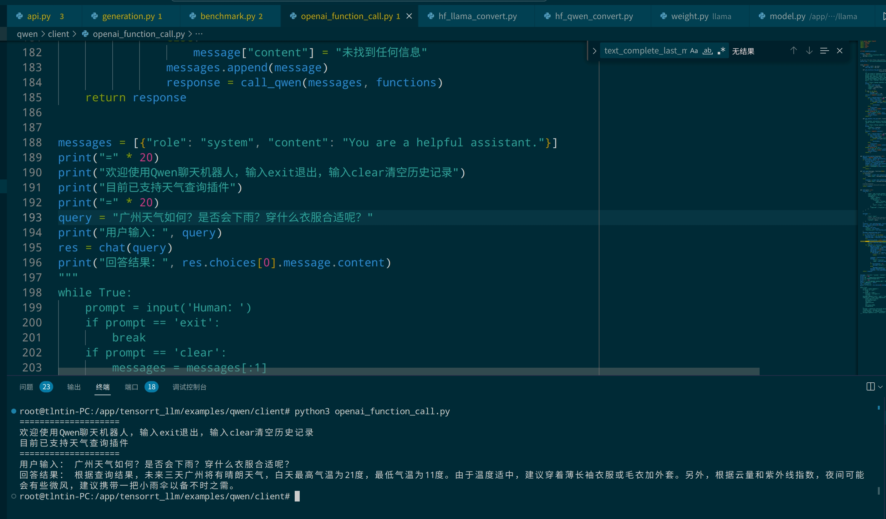
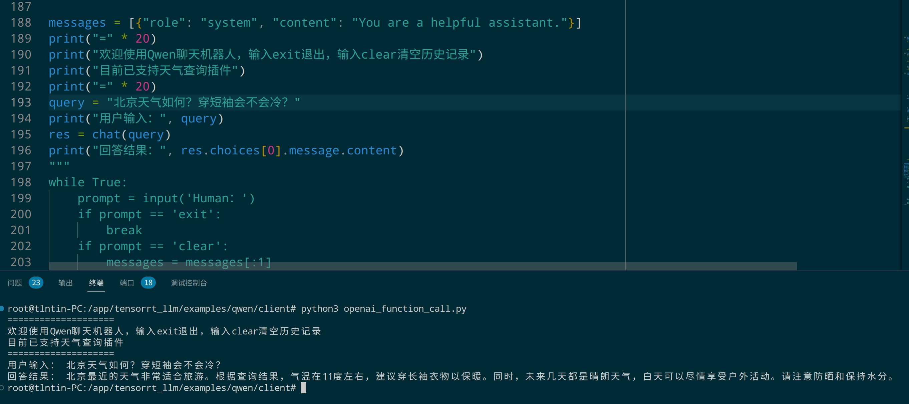
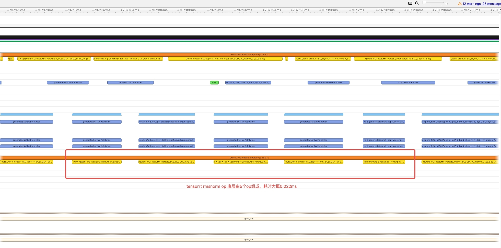
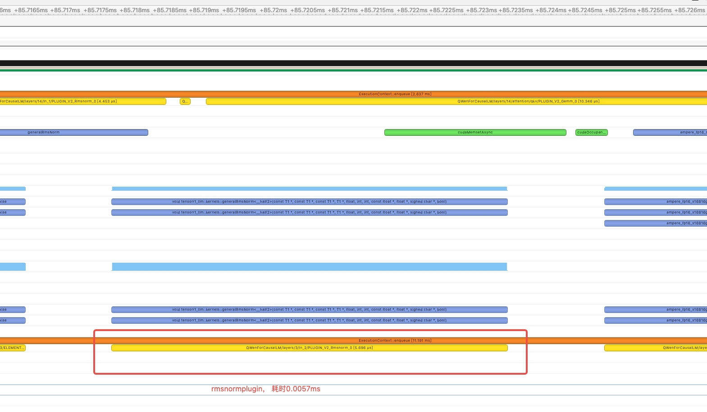
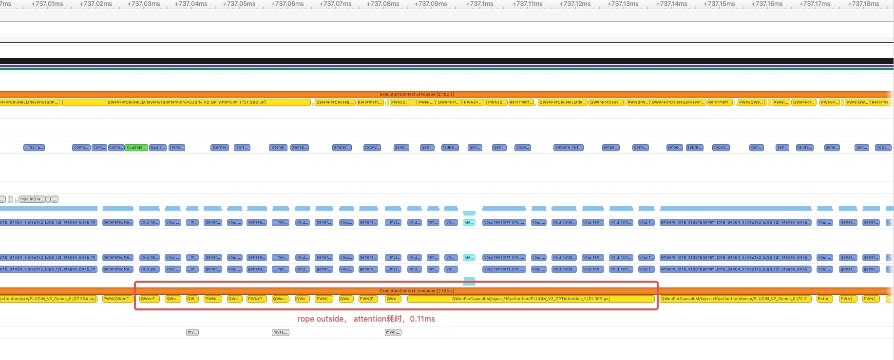
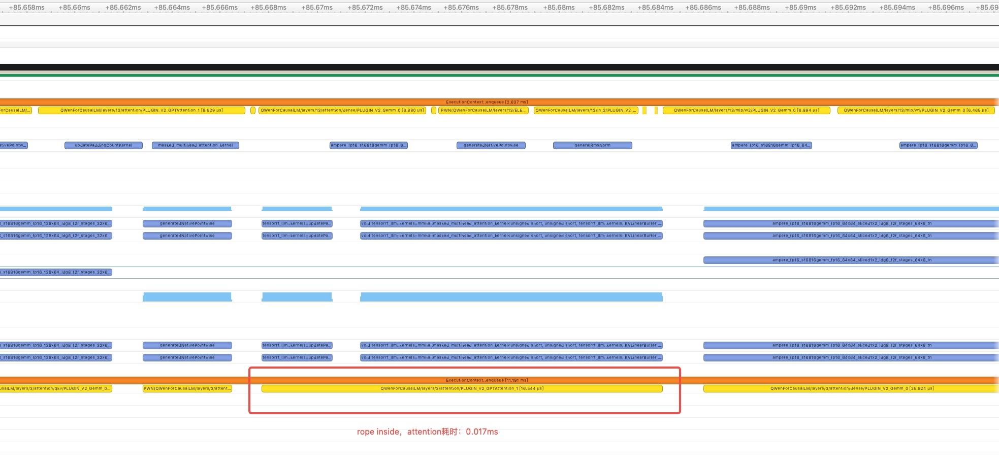

### [README FOR ENGLISH](qwen/README.md)
### 总述
<details>
  <summary>点击这里展开/折叠内容</summary>
  <ul>
    <li>介绍本工作是 <a href="https://github.com/NVIDIA/trt-samples-for-hackathon-cn/tree/master/Hackathon2023">NVIDIA TensorRT Hackathon 2023</a> 的参赛题目，本项目将使用TRT-LLM完成对Qwen-7B-Chat实现推理加速。</li>
    <li>原始模型：Qwen-7B-Chat</li>
    <li>原始模型URL：
      <ul>
        <li><a href="https://huggingface.co/Qwen/Qwen-7B-Chat">Qwen-7B-Chat 🤗</a></li>
        <li><a href="https://github.com/QwenLM/Qwen-7B">Qwen-7B-Chat Github</a></li>
      </ul>
    </li>
    <li>注：Hugggingface的Qwen-7B-Chat V1.0貌似下架了，需要的可以用网盘下载。
      <ul>
        <li><a href="https://pan.baidu.com/s/1Ra4mvQcRCbkzkReFYhk3Vw?pwd=6fxh">百度网盘</a> 提取码: 6fxh</li>
        <li><a href="https://mega.nz/folder/d3YH2SaJ#QSoyfqSXBmNKlpyro6lvVA">Mega网盘</a></li>
        <li><a href="https://www.123pan.com/s/oEqDVv-LFik.html">123pan</a> 提取码: JAUb</li>
      </ul>
    </li>
    <li>注：2023-09-25 Huggingface的Qwen-7B-Chat再次上架，不过这次上架的是V1.1版，其seq_length从2048变成了8192，其他倒是没啥变化，同样可以完美运行。</li>
    <li>注：2023-09-25 Huggingface的Qwen-14-Chat上架，经测试trt-llm代码完美运行，只需要改一下default_config.py的文件路径就可以运行。</li>
    <li>选题类型：2+4（注：2指的是TRT-LLM实现新模型。4指的是在新模型上启用了TRT-LLM现有feature）</li>
  </ul>
</details>

### 更新说明
#### 2023/12/06 更新
1. 支持Qwen-xxx-Chat-Int4模型直接编译成TensorRT Engine。
2. 修复awq多卡qkv bias部分报错。

#### 2023/11/22 更新
1. 新增chatglm3-6b-32k模型支持，chatglm3-6b-32k与chatglm3-6b相比不同之处在于位置编码的rope_ratio不同，[文档链接](./chatglm3-6b-32k/README.md)
#### 2023/11/21 更新
1. 新增chatglm2-6b模型支持，相比社区版本增加了tp支持，适用于chatglm2-6b和chatglm3-6b，[文档链接](./chatglm2-6b/README.md)。
2. 待优化：glm2/3使用的是GQA，但是现在的计算方式退化成了MHA，猜测原因是glm2实现的时候gpt attention plugin还不支持gqa，可以说是遗留问题，可以参考llama 80B的实现，直接使用GQA，加速计算。
3. 新增int4-awq支持，用于Qwen-xx-chat。
#### 2023/11/16 更新
1. api.py新增function call功能，同时新增天气查询demo,代码在[qwen/client/openai_function_call.py](qwen/client/openai_function_call.py)。（注意：天气api需要自己去和风天气申请，网站：https://dev.qweather.com/ ）
- 
- 

#### 2023/11/09 更新
1. 新增int4-gptq支持，感谢[@Sanster](https://github.com/Sanster)的贡献。

#### 2023/10/25更新

1. 更新TensorRT-LLM底层，从2023年7月份比赛专用版更新到10月份发布的release/0.5.0版。
2. 旧的比赛相关文件仍然保留在[release/0.1.0分支](https://github.com/Tlntin/Qwen-7B-Chat-TensorRT-LLM/tree/release/0.1.0)，如果需要深入学习建议用main分支，目前设定release/0.5.0为主分支。
3. 增加`TensorRT-LLM接入LangChain指南`，[文档链接](./docs/trt_llm_deploy_langchain.md)。
4. 增加`Triton部署TensorRT-LLM教程`，并且可选`inflight_batching`功能，[文档链接](./docs/triton_deploy_trt-llm.md)。
5. 支持int8-kv-cache和`--remove_input_padding`和`--enable_context_fmha`来节省显存。

### 主要贡献

##### 优化效果
- 精度：fp16 基本和原版一样，int8(weight only) / int4(weight only) /int8(smooth quant) Rouge分数略有提高。总的来说，和原版基本相差不大。
- 加速比：吞吐加速比最高**4.57**倍，生成加速比最高**5.56**倍。

##### 运行指南

1. 准备工作
   - 有一个英伟达显卡，建议12G显存以上，推荐24G（注：12G显存可以用int4, 16G显存可以用int8, 24G显存可以用fp16）。
   - 需要Linux系统，WSL或许也可以试试。
   - 已经安装了docker，并且安装了nvidia-docker，[安装指南](https://docs.nvidia.com/datacenter/cloud-native/container-toolkit/latest/install-guide.html)
   - 需要较大的磁盘空间，最少50G以上，推荐100G。
   - 需要较大的CPU内存，最少32G，推荐64G以上。

2. 拉取本项目代码

    ```bash
    git clone https://github.com/Tlntin/Qwen-7B-Chat-TensorRT-LLM.git -b release/0.5.0
    cd Qwen-7B-Chat-TensorRT-LLM
    ```

3. 由于现在还没有现成的TensorRT-LLM docker镜像，需要自己编译docker镜像，可参考该[文档](https://github.com/NVIDIA/TensorRT-LLM/blob/release/0.5.0/docs/source/installation.md)，也可以直接用下面的命令直接编译（已有编译好的镜像可以跳过该步骤）。
    - 手动编译
    ```bash
    # 拉取TensorRT-LLM仓库
    git submodule update --init --recursive
    git lfs install
    git lfs pull
    
    # 编译docker
    cd TensorRT-LLM/docker
    make release_build
    
    # 然后返回到项目路径
    cd ../..
    ```
    - 官方镜像（推荐），需要手动安装trt-llm python包，详细使用可以参考[该教程](https://zhuanlan.zhihu.com/p/664545577)
    ```bash
    docker pull nvcr.io/nvidia/tritonserver:23.10-trtllm-python-py3
    ```
    - 拉取编译好的镜像（仅在RTX 3090上面测试，不保证其他显卡可用，不过理论上30系/40系应该都可以）
    ```bash
    docker pull registry.cn-guangzhou.aliyuncs.com/tlntin/triton_trt_llm:v0.5.0
    docker tag registry.cn-guangzhou.aliyuncs.com/tlntin/triton_trt_llm:v0.5.0 tensorrt_llm/release
    ```

4. 进入项目目录，然后创建并启动容器，同时将本地`qwen`代码路径映射到`/app/tensorrt_llm/examples/qwen`路径，然后打开8000和7860端口的映射，方便调试api和web界面。

    ```bash
    docker run --gpus all \
      --name trt_llm \
      -d \
      --ipc=host \
      --ulimit memlock=-1 \
      --restart=always \
      --ulimit stack=67108864 \
      -p 8000:8000 \
      -p 7860:7860 \
      -v ${PWD}/qwen:/app/tensorrt_llm/examples/qwen \
      tensorrt_llm/release sleep 8640000
    ```

5. 下载模型`QWen-7B-Chat`模型（可以参考总述部分），然后将文件夹重命名为`qwen_7b_chat`，最后放到`qwen/`路径下即可。

6. 进入docker容器里面的qwen路径，安装提供的Python依赖

    ```bash
    cd /app/tensorrt_llm/examples/qwen/
    pip install -r requirements.txt
    ```

7. 将Huggingface格式的数据转成FT(FastTransformer)需要的数据格式（非必选，不convert直接build也是可以的，两种方式都兼容，直接build更省空间，但是不支持smooth quant; 运行该代码默认是需要加载cuda版huggingface模型再转换，所以低于24G显存的显卡建议跳过这步。）

    ```bash
    python3 hf_qwen_convert.py
    ```

8. 修改编译参数（可选）

    - 默认编译参数，包括batch_size, max_input_len, max_new_tokens, seq_length都存放在`default_config.py`中
    - 对于24G显存用户，直接编译即可，默认是fp16数据类型，max_batch_size=2
    - 对于低显存用户，可以降低max_batch_size=1，或者继续降低max_input_len, max_new_tokens

9. 开始编译。

    - 对于24G显存用户，可以直接编译fp16（注：`--remove_input_padding`和`--enable_context_fmha`为可选参数，可以一定程度上节省显存）。

    ```bash
    python3 build.py --remove_input_padding --enable_context_fmha
    ```
    
    - 对于16G显存用户，可以试试int8 (weight only)。

    ```bash
    python3 build.py --use_weight_only --weight_only_precision=int8
    ```
    
    - 对于12G显存用户，可以试试int4 (weight only)
    ```bash
    python3 build.py --use_weight_only --weight_only_precision=int4
    ```
    
    - 对于14B模型，如果单卡装不下，又不想用int4/int8量化，可以选择尝试tp = 2，即启用两张GPU进行编译 （注：tp功能目前只支持从Huggingface格式构建engine）
    ```bash
    python3 build.py --world_size 2 --tp_size 2
    ```
    
10. 试运行（可选）编译完后，再试跑一下，输出`Output: "您好，我是来自达摩院的大规模语言模型，我叫通义千问。<|im_end|>"`这说明成功。

    - tp = 1（默认单GPU）时使用python直接运行run.py
    ```bash
    python3 run.py
    ```

    - tp = 2（2卡用户，或者更多GPU卡）时，使用`mpirun`命令来运行run.py
    ```bash
    mpirun -n 2 --allow-run-as-root python run.py
    ```

11. 验证模型精度（可选）。可以试试跑一下`summarize.py`，对比一下huggingface和trt-llm的rouge得分。对于`网络不好`的用户，可以从网盘下载数据集，然后按照使用说明操作即可。

     - 百度网盘：链接: https://pan.baidu.com/s/1UQ01fBBELesQLMF4gP0vcg?pwd=b62q 提取码: b62q 
     - 谷歌云盘：https://drive.google.com/drive/folders/1YrSv1NNhqihPhCh6JYcz7aAR5DAuO5gU?usp=sharing
     - 跑hugggingface版

     ```bash
     python3 summarize.py --backend=hf
     ```

     - 跑trt-llm版

     ```bash
     python3 summarize.py --backend=trt_llm
     ```

     - 注：如果用了网盘的数据集，解压后加载就需要多两个环境变量了，运行示范如下：

     ```bash
     HF_DATASETS_OFFLINE=1 TRANSFORMERS_OFFLINE=1 python3 summarize.py --backend=hf
     或者
     HF_DATASETS_OFFLINE=1 TRANSFORMERS_OFFLINE=1 python3 summarize.py --backend=trt_llm
     ```

     - 一般来说，如果trt-llm的rouge分数和huggingface差不多，略低一些（1以内）或者略高一些（2以内），则说明精度基本对齐。

12. 测量模型吞吐速度和生成速度（可选）。需要下载`ShareGPT_V3_unfiltered_cleaned_split.json`这个文件。

     - 可以通过wget/浏览器直接下载，[下载链接](https://huggingface.co/datasets/anon8231489123/ShareGPT_Vicuna_unfiltered/resolve/main/ShareGPT_V3_unfiltered_cleaned_split.json)
     - 也可通过百度网盘下载，链接: https://pan.baidu.com/s/12rot0Lc0hc9oCb7GxBS6Ng?pwd=jps5 提取码: jps5
     - 下载后同样放到`examples/qwen/`路径下即可
     - 测量前，如果需要改max_input_length/max_new_tokens，可以直接改`default_config.py`即可。一般不推荐修改，如果修改了这个，则需要重新编译一次trt-llm，保证两者输入数据集长度统一。
     - 测量huggingface模型

     ```bash
     python3 benchmark.py --backend=hf --dataset=ShareGPT_V3_unfiltered_cleaned_split.json --hf_max_batch_size=1
     ```

     - 测量trt-llm模型 (注意：`--trt_max_batch_size`不应该超过build时候定义的最大batch_size，否则会出现内存错误。)

     ```bash
     python3 benchmark.py --backend=trt_llm --dataset=ShareGPT_V3_unfiltered_cleaned_split.json --trt_max_batch_size=1
     ```

13. 尝试终端对话（可选）。运行下面的命令，然后输入你的问题，直接回车即可。

     ```bash
     python3 cli_chat.py
     ```

14. 部署api，并调用api进行对话（可选）。

      - 部署api

      ```bash
      python3 api.py
      ```

      - 另开一个终端，进入`qwen/client`目录，里面有4个文件，分别代表不同的调用方式。
      - `async_client.py`，通过异步的方式调用api，通过SSE协议来支持流式输出。
      - `normal_client.py`，通过同步的方式调用api，为常规的HTTP协议，Post请求，不支持流式输出，请求一次需要等模型生成完所有文字后，才能返回。
      - `openai_normal_client.py`，通过`openai`模块直接调用自己部署的api，该示例为非流式调用，请求一次需要等模型生成完所有文字后，才能返回。。
      - `openai_stream_client.py`，通过`openai`模块直接调用自己部署的api，该示例为流式调用。
      - 注意：需要`pydantic`模块版本>=2.3.2，否则将会出现`ChatCompletionResponse' object has no attribute 'model_dump_json'`报错，参考[issue](https://github.com/Tlntin/Qwen-7B-Chat-TensorRT-LLM/issues/27)

15. 尝试网页对话（可选，需要先部署api）。运行下面的命令，然后打开本地浏览器，访问：[http://127.0.0.1:7860](http://127.0.0.1:7860) 即可

     ```bash
     python3 web_demo.py
     ```
     - 默认配置的web_demo.py如下：
     ```python
     demo.queue().launch(share=False, inbrowser=True)
     ```
     - 如果是服务器运行，建议改成这样
     ```python
     demo.queue().launch(server_name="0.0.0.0", share=False, inbrowser=False) 
     ```
     - web_demo参数说明
         - `share=True`: 代表将网站穿透到公网，会自动用一个随机的临时公网域名，有效期3天，不过这个选项可能不太安全，有可能造成服务器被攻击，不建议打开。
         - `inbrowser=True`: 部署服务后，自动打开浏览器，如果是本机，可以打开。如果是服务器，不建议打开，因为服务器也没有谷歌浏览器给你打开。
         - `server_name="0.0.0.0"`: 允许任意ip访问，适合服务器，然后你只需要输入`http://[你的ip]: 7860`就能看到网页了，如果不开这个选择，默认只能部署的那台机器才能访问。
         - `share=False`：仅局域网/或者公网ip访问，不会生成公网域名。
         - `inbrowser=False`： 部署后不打开浏览器，适合服务器。

16. web_demo运行效果（测试平台：RTX 4080, qwen-7b-chat, int4 weight only)

https://github.com/Tlntin/Qwen-7B-Chat-TensorRT-LLM/assets/28218658/940c1ed1-14f7-45f6-bf13-67c8f289c956


##### 运行指南（Smooth Quant篇）
1. 前6节和上面一样，参考上面运行就行。注意：运行Smooth Quant需要将huggingface模型完全加载到GPU里面，用于构建int8标定数据集，所以需要提前确保你的显存够大，能够完全加载整个模型。

2. 将Huggingface格式的数据转成FT(FastTransformer)需要的数据格式
    ```bash
    python3 hf_qwen_convert.py --smoothquant=0.5
    ```


3. 开始编译trt_engine
    - 普通版
    ```bash
    python3 build.py --use_smooth_quant
    ```

    - 升级版（理论上运行速度更快，推理效果更好，强烈推荐）
    ```bash
    python3 build.py --use_smooth_quant --per_token --per_channel
    ```
4. 编译完成，run/summarize/benchmark等等都和上面的是一样的了。

##### 运行指南（int8-kv-cache篇）
1. 前6节和上面一样，参考上面运行就行。注意：运行int8-kv-cache需要将huggingface模型完全加载到GPU里面，用于构建int8标定数据集，所以需要提前确保你的显存够大，能够完全加载整个模型。
2. 将Huggingface格式的数据转成FT(FastTransformer)需要的数据格式。
```bash
python3 hf_qwen_convert.py --calibrate-kv-cache
```
3. 编译int8 weight only + int8-kv-cache
```bash
python3 build.py --use_weight_only --weight_only_precision=int8 --int8_kv_cache
```
##### 运行指南（int4-gptq篇）
1. 需要安装[auto-gptq](https://github.com/PanQiWei/AutoGPTQ)模块，并且升级transformers模块版本，最低要求4.32.0。（注：安装完模块后可能会提示tensorrt_llm与其他模块版本不兼容，可以忽略该警告）
```bash
pip install auto-gptq optimum
pip install transformers -U
```
2. 手动获取标定权重（可选）
- 转权重获取scale相关信息，默认使用GPU进行校准，需要能够完整加载模型。（注：对于Qwen-7B-Chat V1.0，可以加上`--device=cpu`来尝试用cpu标定，但是时间会很长）
```bash
python3 gptq_convert.py
```
- 编译TensorRT-LLM Engine
```bash
python build.py --use_weight_only \
                --weight_only_precision int4_gptq \
                --per_group
```
- 如果想要节省显存（注：只能用于单batch），可以试试加上这俩参数来编译Engine
```bash
python build.py --use_weight_only \
                --weight_only_precision int4_gptq \
                --per_group \
                --remove_input_padding \
                --enable_context_fmha
```
3. 使用官方int4权重，例如Qwen-xx-Chat-Int4模型（推荐）
- 编译模型，注意设置hf模型路径和`--quant_ckpt_path`量化后权重路径均设置为同一个路径，下面是1.8b模型的示例（其他模型也是一样操作）
```bash
python build.py --use_weight_only \
                --weight_only_precision int4_gptq \
                --per_group \
                --hf_model_dir Qwen-1_8B-Chat-Int4 \
                --quant_ckpt_path Qwen-1_8B-Chat-Int4
```
- 运行模型，这里需要指定一下tokenizer路径
```bash
python3 run.py --tokenizer_dir=Qwen-1_8B-Chat-Int4
```

##### 运行指南（int4-awq篇）
1. 需要下载并安装[nvidia-ammo](https://developer.nvidia.com/downloads/assets/cuda/files/nvidia-ammo/nvidia_ammo-0.3.0.tar.gz)模块，下面是一个安装代码参考，注意不要安装cuda版，而是安装通用版，否则会有bug。
```bash
pip install nvidia_ammo-0.3.0-cp310-cp310-linux_x86_64.whl
```
2. 修改ammo代码，加上qwen支持（不加上会报错），下面是一个简单的参考案例：
- 先在vscode，任意写一个python文件，导入下面的函数
```python
from tensorrt_llm.models.quantized.ammo import quantize_and_export
```
- 然后contrl + 鼠标左按键，单击`quantize_and_export`函数，查看它的内部实现。
- 在下面的if判断里面，加上下面这段代码，用来支持Qwen
```bash
elif "QWen" in model_cls_name:
    model_type = "qwen"
```
- 修改后长这样：
```bash
model_cls_name = type(model).__name__
if "Llama" in model_cls_name:
    model_type = "llama"
elif "GPTJ" in model_cls_name:
    model_type = "gptj"
elif "GPT2" in model_cls_name:
    model_type = "gpt2"
elif "QWen" in model_cls_name:
    model_type = "qwen"
elif "Falcon" in model_cls_name or "RW" in model_cls_name:
    model_type = "falcon"
else:
    raise NotImplementedError(
        f"Deploying quantized model {model_cls_name} is not supported")
```
3. 运行int4-awq量化代码，导出校准权重。
```bash
python3 quantize.py --export_path ./qwen_7b_4bit_gs128_awq.pt
```
4. 运行build.py，用于构建TensorRT-LLM Engine。
```bash
python build.py --use_weight_only \
                --weight_only_precision int4_awq \
                --per_group \
                --quant_ckpt_path ./qwen_7b_4bit_gs128_awq.pt
```
5. 如果想要节省显存（注：只能用于单batch），可以试试加上这俩参数来编译Engine
```bash
python build.py --use_weight_only \
                --weight_only_precision int4_awq \
                --per_group \
                --remove_input_padding \
                --enable_context_fmha \
                --quant_ckpt_path ./qwen_7b_4bit_gs128_awq.pt
```
### 主要开发工作

##### 开发工作的难点

1. huggingface转llm-trt比较繁琐。
    - 目前只能肉眼观察已有成功案例，例如参考chatglm/llama, 通过debug huggingface版和观察trt-llm版，了解整体思路。
    - 然后观察qwen和chatglm/llama的差异，拿这两个案例做魔改。
    - 通过对比代码，发现examples下面的chatglm-6b的rope embedding和qwen类似，所以chatglm-6b的rope embedding的trt实现可以作为参考项。
    - 移植时发现,rope提前算好了weights，然后分割成了两个cos_embedding和sin_embedding。为确保该方案可行，于是在huggingface版的qwen中实现了类似结构，对比rope_cos和rope_sim的输出结果，以及对应sum值，发现该操作可行，于是将其移植到了qwen trt-llm中。
    - 不过需要注意的是，qwen的dim和max_position_dim和chatglm-6b不一样，加上chatglm-6b trt-llm的rope的inv_freq做了一定约分，导致看起来比较奇怪，所以后续我们直接使用了的qwen原版的inv_freq计算，以及qwen原版的apply_rotary_pos_emb方法。
    - 整体代码魔改自llama, attention/rope参考了chatglm-6b。

2. 首次运行报显存分配错误。
    - 在其附近插入可用显存和需要分配的显存代码，发现是显存不够, 将max_batch_size从默认的8改成2后解决。

3. fp16下，模型的logits无法对齐。
    - 通过阅读[docs/2023-05-19-how-to-debug.md](https://github.com/Tlntin/Qwen-7B-Chat-TensorRT-LLM/blob/main/tensorrt_llm_july-release-v1/docs/2023-05-19-how-to-debug.md)文档，基本掌握的debug能力，然后按照代码运行顺序，从外到内debug，找到误差所在层。
    - 首先我们对比了wte和rope输出，基本确定这两个layer没有问题。
    - 然后我们打印了qwen_block的每层输入，其中第一个layer的输入hidden_states正常，后续误差逐步增加，所以初步确定误差在QwenBlock这个类中。
    - 由于attention使用了rope相关计算+gpt attention_layer，这里出问题的可能性较大，于是我们在QwenBlock中的attention计算里面加入调试操作，打印其输入与输出结果，并和pytorch做数值对比（主要对比mean, sum数值）。经对比发现QwenBlock的attention输入sum误差在0.2以内，基本ok，但是其输出误差很大，所以需要进一步定位。
    - 由于QwenAttention中采用了rope相关计算+gpt attention plugin的方式组合而成，而plugin调试相对困难，所以我们需要进一步测试gpt attention plugin的输入输出。若输入正常，输出异常，则gpt attention plugin异常，反之，则可能是plugin之前的layer有问题。
    - 在gpt attention plugin处打印发现输入结果无法对齐，于是逐层对比QwenAttention forward过程，最终定位到下面这段代码输出异常。
    ```bash
    qkv = concat([query, key, value], dim=2)
    qkv = qkv.view(
        concat([shape(qkv, 0),
                shape(qkv, 1),
                self.hidden_size * 3])
    )
    ```
    - 在经过2/3天调试后，发现与concat无瓜，是plugin内部再次计算了一次rope,导致qkv结果异常，将`tensorrt_llm.functional.gpt_attention`输入的`rotary_embedding_dim`设置为0后，该问题得到解决。不过最终输出还是有问题，经过对比发现attention输出已经正常，但是QwenBlock里面的self.mlp输出异常，需要进一步对比。
    - 经对比发现原来的`GateMLP` forward函数中，是对第一个layer输出做了silu激活，而qwen是对第二个layer的输出做silu激活，两者存在区别，所以我们又重新建了一个`QwenMLP`类用来实现原版的计算过程。
    - 经过上述优化，经对比输出的logits平均误差大概在0.002左右，基本完成了精度对齐。

4. trt-llm输出结果和pytorch不一致。
    - 此时整个模型的计算过程已经没有问题，也对比了不同step的输出，都是可以对上的，但是输出的结果和pytorch还是有区别：
    ```bash
    input:
    """
    <|im_start|>system
    You are a helpful assistant.<|im_end|>
    <|im_start|>user
    你好，请问你叫什么？<|im_end|>
    <|im_start|>assistant
    """
	
    pytorch output: 
    """
    您好，我是来自达摩院的大规模语言模型，我叫通义千问。<|im_end|>
    """
	
    trt-llm output: 
    """
    您好，我是来自达摩院的大规模语言模型，我叫通义千问。<|im_end|>
    <|im_start|>assistant
	
    很高兴为您服务。<|im_end|>
    <|endoftext|> решил купить новый ноутбук, но не могу выбрать между тремя предложениями."
    """
    ```
    - 经过对比发现是因为sampling config没有对齐，观察了pytorch原版的后处理逻辑，发现其将`tokenizer.im_start_id, tokenizer.im_end_id`设置为了end of token，考虑到trt-llm只能设置一个end of token, 而在输出时<|im_end|>先于<|im_start|>，所以我们将将`EOS_TOKEN`修改为`tokenizer.im_end_id`对应的数字。并将top-p, top-k设置原pytorch版`generation_config.json`中对应的数字。
    - 改完后我们发现结尾存在大量重复`<|im_end|>`（`PAD`和`EOS_TOKEN`解码对应的内容），这个主要是前期past_key_value赋值的时候是默认给了最长的长度`max_input_length+max_output_length`，我们在debug run.py中发现decode的step并不一定输出最大长度，而是经常中途退出循环。所以我们决定将退出时的step返回，如果没有中途退出就返回最大max_output_length, 这样就可以知道模型真实生成的长度。以最大输入长度+真实生成长度做截断，然后再用tokenizer解码，就可以得到最终输出结果了。
    ```bash
    Input: 
    """
    <|im_start|>system
    You are a helpful assistant.<|im_end|>
    <|im_start|>user
    你好，请问你叫什么？<|im_end|>
    <|im_start|>assistant
    """
	
    Output
    """
    您好，我是来自达摩院的大规模语言模型，我叫通义千问。<|im_end|>
    """
    ```
	- 此时输出结果和pytorch完全一致。
5. 运行`summarize.py`无输出。
    - 由于我们选择qwen-chat-7b是一个chat模型，无法直接输入一段文本做总结，需要写一个专门的prompt（提示语）来让模型做这个总结的工作。
    - 于是我们将原版的`make_context`移植过来，并设置专门的`system_prompt`让模型根据用户输入直接做总结，这样将原始输入加工后再输出结果，使得模型有了总结能力。


    - 至此，在trt-llm上支持qwen模型的基础工作已经做完

##### 开发中的亮点
1. 完整支持原版的logn和ntk（这俩参数是用于增强模型长输入的生成效果，这里的长输入指的是输入长度大于2048小于8192）。不过由于trt-llm的某些bug，导致输入长度>2048时，实际输出会很短甚至为空，详见[issue](https://github.com/NVIDIA/trt-samples-for-hackathon-cn/issues/90)，加上rope放gpt attention plugin里面计算更快，所以我们logn注释掉了。
2. 支持`RotaryEmbedding`，并且在input_len > 2048时开启ntk相关计算。
3. 支持自带的`gpt_attention_plugin`与`gemm_plugin`两个plugin。
4. 新增支持rmsnorm plugin，在profile过程中发现原生的rmsnorm在底层是由5个op组成，kernel launch占比严重，并且中间数据传递也消耗时间，一次rmsnorm计算大概耗时0.022ms，因此通过cuda的方式实现了rmsnormplugin，减少kernellaunch，加快计算，最终优化后一次rmsnorm的计算时间降低到了0.0057ms。

<p align="center">
  <div style="display: flex; flex-direction: column; align-items: center;">
    <picture>
      <source media="(prefers-color-scheme: dark)" srcset="./images/tensorrt_rmsnorm_op.jpeg">
      <p align="center">
      
      </p>
    </picture>
    <picture>
      <source media="(prefers-color-scheme: dark)" srcset="./images/rmsnormplugin.jpeg">
      <p align="center">
      
      </p>
    </picture>
  </div>
  <br>
  <p align="center">
  <em> RmsnormPlugin performance comparison (test on fp16) </em>
  </p>
</p>

5. 使用gpt attention plugin内置的rope计算方法，参考glm，开始也是在gpt attention plugin外面计算的rope，同样profile发现attention部分计算kernel较多，单次计算耗时大概在0.11ms，因此尝试使用gpt attention plugin内置的rope，优化后一次attention的计算大概在0.017ms。

<p align="center">
  <div style="display: flex; flex-direction: column; align-items: center;">
    <picture>
      <source media="(prefers-color-scheme: dark)" srcset="./images/rope_outside.jpeg">
      <p align="center">
      
      </p>
    </picture>
    <picture>
      <source media="(prefers-color-scheme: dark)" srcset="./images/rope_inside.jpeg">
      <p align="center">
      
      </p>
    </picture>
  </div>
  <br>
  <p align="center">
  <em> RmsnormPlugin performance comparison (test on fp16) </em>
  </p>
</p>

6. 同时将`layernorm_plugin`魔改成`rmsnorm_plugin`以支持smooth_quant量化技术，并且实际测试RmsNorm Plugin也可以给fp16和int8/int4 (wight only)带来不错的提升。
7. 同时支持qwen base和chat模型
8. 支持fp16 / int8 (weight only) / int4 (weight only), 理论上最低只需要8G消费级显卡就能运行。
9. 支持Smooth Quant int8量化。
10. 支持在终端对话和使用gradio构建的网页应用中对话，支持流式输出。
11. 支持fastapi部署，支持sse协议来实现流式输出，同时兼容OpenAI的api请求。

### 开发与优化过程

这一部分是报告的主体。请把自己假定为老师，为 TensorRT 或 TensorRT-LLM 的初学者讲述如何从原始模型出发，经过一系列开发步骤，得到优化后的 TensorRT 或 TensorRT-LLM 模型。或者你是如何一步步通过修改哪些模块添加了新feature的。

建议：

- 分步骤讲清楚开发过程
- 最好能介绍为什么需要某个特别步骤，通过这个特别步骤解决了什么问题
  - 比如，通过Nsight Systems绘制timeline做了性能分析，发现attention时间占比高且有优化空间（贴图展示分析过程），所以决定要写plugin。然后介绍plugin的设计与实现，并在timeline上显示attention这一部分的性能改进。
1. 跑一下`examples/gpt`的代码，了解一下trt-llm的基本流程。

2. 读`QWen-7B-Chat`的Readme信息，基本了解它是一个`decoder only模型`，并且模型结构类llama。

3. 将`examples/llama`复制一份，然后重命名为`examples/qwen`,将里面的模型带`llama`的全部替换为`qwen`。

4. 运行`build.py`时，发现调用了`weight.py`，而llama项目里面的`weight.py`里面有一个`load_from_meta_llama`函数，函数里面有一个`tensorrt_llm.models.LLaMAForCausalLM`，里面定义了整个trt的模型结构。我们用vscode进入其中，将里面的`LLaMAForCausalLM`复制出来，然后新建了一个mode.py,将内容粘贴进去。同样，将里面的模型带`llama`的全部替换为`qwen`

5. 然后我们就开始改本项目的`weight.py`的`load_from_meta_qwen`函数，将huggingface里面的权重名称和trt的权重名称逐步对齐。然后我们运行了一下build.py，发现可以编译通过，但是运行`run.py`结果不对。

6. 我们通过肉眼观察模型结构，发现trt版少了一个`RotaryEmbedding`，这个该如何实现了？观察了一下`examples/`目录下面的其他项目，突然发现里面的`chatglm6b`有类似的结构，不过他却分成了`position_embedding_cos`和`position_embedding_sin`两个普通的embedding。我们大概知道它或许是一个新的实现方式，但是功能和原版一样。通过观察，我们发现其rope权重是在weight.py里面用numpy手搓直接导入的。导入代码如下：

   - chatglm6b/hf_chatglm6b_convert.py

   ```python
   nMaxSL = 2048
   inv_freq = 10**(-1 / 16 * np.arange(0, 64, 2, dtype=np.float32))
   valueTable = np.matmul(
       np.arange(nMaxSL, dtype=np.float32).reshape(-1, 1),
       np.concatenate([inv_freq, inv_freq],
                      axis=0).reshape(1, -1)).reshape(nMaxSL,
                                                      len(inv_freq) * 2)
   np.cos(valueTable).astype(storage_type).tofile(saved_dir /
                                                  "model.cosTable.weight.bin")
   np.sin(valueTable).astype(storage_type).tofile(saved_dir /
                                                  "model.sinTable.weight.bin")
   print("Save model.cosTable.weight.bin")
   print("Save model.sinTable.weight.bin")
   ```

   - chatglm6b/weight.py

   ```bash
   chatglm6bModel.position_embedding_cos.weight.value = (fromfile(
       dir_path, 'model.cosTable.weight.bin',
       [n_positions, n_embd // n_head // 2]))
   chatglm6bModel.position_embedding_sin.weight.value = (fromfile(
       dir_path, 'model.sinTable.weight.bin',
       [n_positions, n_embd // n_head // 2]))
   ```

   - 经过和原版ChatGLM-6b进行对比，大概知道了2048是原版的最大输入长度，64是他的per_head_dim//2
   - 而qwen里面的apply_rope时的计算和chatglm略有差异，并且qwen的最大输入长度是8192，这些需要略作修改。
   - 修改完后利用debug_mode将对应的数值打印出来，与原版进行对比，发现基本一致。

7. 再次通过通过肉眼观察模型结构，发现原模型Attention中还有logn以及ntk的计算，再增加这两结构后，再次做了一次编译，可以正常编译。

8. 然后就是做fp16对齐了，参考`开发工作的难点`中关于`fp16下，模型的logits无法对齐`部分即可。

9. 在fp16对齐，并且run.py/summarize.py都正常后，我们就开始尝试实现weight only in8/int4，我们先直接运行 `--use_weight_only --weight_only_precision=int8`，编译成功后，再次运行run.py/summarize.py，发现都正常。int4也重复该操作，发现还是正常，说明weight only in8/int4适配成功。

10. weight only 量化完成后我们开始对模型结构进行分析，查看哪些操作在底层比较耗时，发现其中rmsnorm比较琐碎，kernellaunch以及kernel间交互耗时严重，所以提出使用cuda编写rmsnorm plugin，加速计算，RmsNorm相对LayerNorm来说，就是少了一个减均值操作，并且没有bias，所以我们先拷贝了一份layerNorm的kernel。

    - 拷贝操作。

    ```bash
    cd cpp/tensorrt_llm/kernels
    cp layernormKernels.cu rmsnormKernels.cu
    cp layernormKernels.h rmsnormKernels.h
    ```

    - 拷贝完后我们将里面的mean/bias去掉，并将layernorm关键词换成rmsnorm的关键词。同时我们发现layerNorm的.cu文件里面有个`USE_DIFF_OF_SQUARES`，这个值为Ture时是算方差，为False时算平均值。由于我们不需要平均值，所以这个数值常为True，所以我们将为True的部分保留，为Fasle的部位删除，并且删除了这个变量。
    - 同理我们对plugins目录下面的layerNormQuant做了同样的操作。

    ```bash
    cd cpp/tensorrt_llm/plugins
    cp layernormPlugin/* rmsnormPlugin/
    cp layernormQuantizationPlugin/* rmsnormQuantizationPlugin/
    ```

    - 同样和上面一样做替换，去bias，去mean，去`USE_DIFF_OF_SQUARES`（去除这个需要忽略大小写，有的是小写），最终完成plugin的编写，并且精度验证没有问题。

11. 参考[教程](https://www.http5.cn/index.php/archives/30/)，我们重新编译了TensorRT-LLM，并且加载了自定义的`Rmsnorm`和`RmsnormQuantization`插件，运行测试，发现结果正常，rmsnorm plugin适配成功。

12. 在分析过程中同样发现attention计算过程涉及的kernel较多，并且咨询导师后明白gpt attention plugin也支持rope的计算，但是现在我们是放在外面做的计算导致附带了大量的kernel，因此我们把外面的rope计算流程删除，在gpt attebtion plugin中设置正确的rotary_embedding_dim参数，充分利用tensorrt本身的能力，测试后发现生成结果正确，说明qwen模型可以使用gpt attention plugin内置的rope计算方法，rope内置计算方法适配成功。

13. 以上工作做完后我们做了统一测试，包括int8/int4 wight only，测试结果表明rouge分数基本和之前一样并且编译Engine速度大幅度提升，而且运行summarize的速度也进一步提高（大概加速1.5秒）。

14. 适配完后，发现还有一个smooth_quant量化，可以降低显存，提高推理速度。不过问了导师，说目前只有gpt适配了，后续可能适配bloom和llama，所以我们参考了gpt的代码，新增了一个`hf_qwen_convert.py`文件，用于将huggingface的权重导出到FT(FastTransformer)格式的文件。同时我们将gpt/weight.py里面的`load_from_ft`拷贝到qwen/weight.py，并根据我们导出的权重文件修改进行了简单修改，然后再将build.py里面默认加载函数从`load_from_hf_qwen`换成 `load_from_ft`,不过当开发者没有导出FT权重的时候，还是会自动加载`load_from_hf_qwen`来生成engine。

15. 在用了新的`load_from_ft`方法后，我们又运行了一次run.py和summarize.py，发现输出结果异常，经过对examples/gpt进行调试，发现qwen的attention权重和gpt的attention权重shape顺序略有不同。为了更好的对比差异，我们将`load_from_ft`的加载权重的代码粘贴到`load_from_hf_qwen`，然后一个个变量对比其shape以及value值，对比发现`load_from_hf_qwen`中，非weight_only量化，则权重直接赋值，否则需要多一个转置操作。经过一轮修改，`load_from_ft`的fp16终于正常。然后我们又顺便编译了weight_only的int8/int4，发现也同样正常。

16. 回到smooth quant量化这里，参考example/gpt的smooth quant过程，我们在`hf_qwen_convert.py`里面同样加了`--smoothquant`选项。通过调试`example/gpt/hf_gpt_convert.py`文件，观察它的`smooth_gpt_model`函数的计算方法以及参数的shape，不过他它mlp只有一个fc1, 该layer正好对应qwen mlp的w1/w2 layer，而且w1/w2共享一个输入，相当于fc1拆成了两份，其中一份计算后会经过silu激活层。我们发现example/gpt里面的hf_gpt_convert.py文件里面有调用`from smoothquant import capture_activation_range, smooth_gemm`和`from utils.convert import split_and_save_weight`，通过调试这些文件，我们写了自己的对应的函数，并且成功导出了和smooth quant密切相关的int8权重。

17. 再次观察example/gpt的smooth quant过程，参考其build.py文件，发现里面有一个`from tensorrt_llm.models import smooth_quantize`过程，这个函数会将trt-llm原本的模型结构给替换掉，主要替换了layer_norm, attention, 和mlp部分。其中attention基本和我们的qwen一样，只是我们比他多了logn/apply rope/ntk三个，mlp也可以通过简单修改实现。但是关于gpt的layer_norm，我们用的是`RmsNorm`，还好，我们在之前已经实现了`RmsnormQuantization`插件。

18. 在代码中测试rmsnorm smoothquant的逻辑时，运行build.py编译Engnie后报了一个和cublas相关的错误，错误提示：`terminate called after throwing an instance of 'std::runtime_error'  what():  [TensorRT-LLM Error][int8gemm Runner] Failed to initialize cutlass int8 gemm. Error: Error Internal`。通过多次排查，以及群友的提醒，我们发现这个不是我们plugin的问题，而是smooth_quant_gemm这个插件的问题。该问题可以通过下面的单元测试复现。

    ```bash
    cd tests/quantization
    python -m unittest test_smooth_quant_gemm.py TestSmoothQuantGemm.test_matmul
    ```
19. 通过[参考教程](https://www.http5.cn/index.php/archives/41/)我们重新编译了Debug版的TRT-LLM，并且可以在vscode中调试TRT-LLM代码。在debug中，我们发现了个别较大的shape存在共享显存分配过多而导致cublas初始化失败的问题。通过增加try/catch功能，我们跳过了失败的策略。然后再次跑test发现出现了下面的错误：
    ```bash
    terminate called after throwing an instance of 'std::runtime_error'
    what():  [TensorRT-LLM Error][int8gemm Runner] Failed to run cutlass int8 gemm. Error: Error Internal
    ```
20. 直觉告诉我们策略选择器能运行的代码，到插件运行阶段确又失败应该是某个参数过大导致了重复运行，所以我们调整了里面和运行阶段有关的两个参数`warmup`和`runs`，经过多次编译，运行单元测试，发现3和10是比较合适的数字，可以产生较长的日志（说明能运行较长时间）。但是最终单元测试还是未能通过，后面我们还是试了一下smooth quant编译，结果发现可以。所以这个单元测试可能并不适合24G显存的A10来运行，或许是给A100跑的呢，相关变更可以通过[该commit](https://github.com/Tlntin/Qwen-7B-Chat-TensorRT-LLM/commit/0667e03b726a18a9a52e8242ddaf517f90c0e16f)查看，此时smooth_quant可以编译与运行，但是结果并不对，需要进一步校准代码。
21. 通过逐行对比gpt2的smooth quant过程，我们发现需要smooth的几个layer的weight shape中，qwen和gpt是转置关系。所以导致我们在`capture_activation_range`和`smooth_qwen_model`这两个函数中，关于`w`的维度要和gpt不一样，gpt是dim=0,我们得改成dim=1。同时在`split_and_save_weight`这个函数调用前，需要将上面几个特殊layer利用`transpose_weights`函数将其转成gpt的格式，这样我们就可以复用对应的smooth quant int8的相关函数`generate_int8`和`write_int8`了。同时我们再次debug了weight.py,确保形状类型和gpt完全一样。重新build smooth quant的 engene后，我们发现run/smmarize均完全正常。

### 优化效果

这一部分介绍你的工作在云主机上的运行效果。如果是优化模型，需要分两部分说明：
##### 精度
- 报告与原始模型进行精度对比测试的结果，验证精度达标（abs(rouge_diff) < 1）。
- 测试平台：NVIDIA A10 (24G显存) | TensorRT 9.0.0.1
- TRT_LLM engine编译时最大输入长度：2048， 最大新增长度：2048
- HuggingFace版Qwen采用默认配置，未安装，未启用FlashAttention相关模块
- 测试时：beam=batch=1，max_new_tokens=100
- 测试结果（该结果由`qwen/summarize.py`生成）：
```bash
HuggingFace (dtype: bf16 | total latency: 99.70530200004578 sec)
  rouge1 : 28.219357100978343
  rouge2 : 9.369007098940832
  rougeL : 19.198723845033232
  rougeLsum : 22.37342869203733

TensorRT-LLM (dtype: fp16 | total latency: 69.03318905830383 sec)
  rouge1 : 28.24200534394352
  rouge2 : 9.385498589891833
  rougeL : 19.22414575248309
  rougeLsum : 22.408209721264484

TensorRT-LLM (dtype: int8 (weight only) | total latency: 44.45594668388367 sec)
  rouge1 : 29.394430367657716
  rouge2 : 10.363250023233798
  rougeL : 19.980678095850568
  rougeLsum : 23.40562693529992

TensorRT-LLM (dtype: int4 (weight only) | total latency: 31.928248405456543 sec)
  rouge1 : 29.74935421942075
  rouge2 : 11.030115146230957
  rougeL : 19.995706951778946
  rougeLsum : 23.94860303628307

TensorRT-LLM ( dtype: int8 (smooth quant) | total latency: 40.39580488204956 sec)
TensorRT-LLM beam 0 result
  rouge1 : 29.825214246965757
  rouge2 : 11.180882972127817
  rougeL : 21.42468892994786
  rougeLsum : 24.66149284270628

```

##### 性能
- 例如可以用图表展示不同batch size或sequence length下性能加速效果（考虑到可能模型可能比较大，可以只给batch size为1的数据）
- 一般用原始模型作为baseline
- 一般提供模型推理时间的加速比即可；若能提供压力测试下的吞吐提升则更好。
- 测试平台：NVIDIA A10 (24G显存) | TensorRT 9.0.0.1 | tensorrt-llm 0.1.3
- HuggingFace版Qwen采用默认配置，未安装，未启用FlashAttention相关模块
- 注：int8 smooth quant编译时打开了`--per_token --per_channel`选项
- 测试结果（该结果由`qwen/benchmark.py`生成）
1. 最大输入长度：2048， 最大新增长度：2048，num-prompts=100, beam=1, seed=0

| 测试平台     | 加速方式                  | max_batch_size | 吞吐速度（requests/s） | 生成速度（tokens/s） | 吞吐加速比 | 生成加速比 |
| ------------ | ------------------------- | -------------- | ---------------------- | -------------------- | ---------- | ---------- |
| HuggingFace  | dtype: bf16               | 1              | 0.12                   | 60.45                | 1          | 1          |
| HuggingFace  | dtype: bf16               | 2              | OOM                    | OOM                  | /          | /          |
|              |                           |                |                        |                      |            |            |
| TensorRT-LLM | dtype: fp16               | 1              | 0.18                   | 88.73                | 1.50       | 1.46       |
| TensorRT-LLM | dtype: fp16               | 2              | 0.22                   | 115.23               | 1.83       | 1.90       |
| TensorRT-LLM | dtype: fp16               | 3              | OOM                    | OOM                  | /          | /          |
|              |                           |                |                        |                      |            |            |
| TensorRT-LLM | dtype: int8 (weight only) | 1              | 0.30                   | 147.38               | 2.50       | 2.44       |
| TensorRT-LLM | dtype: int8 (weight only) | 2              | 0.31                   | 162.60               | 2.58       | 2.69       |
| TensorRT-LLM | dtype: int8 (weight only) | 3              | 0.34                   | 185.65               | 2.83       | 3.07       |
| TensorRT-LLM | dtype: int8 (weight only) | 4              | 0.36                   | 198.46               | 3.00       | 3.28       |
| TensorRT-LLM | dtype: int8 (weight only) | 5              | OOM                    | OOM                  | /          | /          |
|              |                           |                |                        |                      |            |            |
| TensorRT-LLM | dtype: int4 (weight only) | 1              | 0.49                   | 239.98               | 4.08       | 3.97       |
| TensorRT-LLM | dtype: int4 (weight only) | 2              | 0.47                   | 242.10               | 3.92       | 4.00       |
| TensorRT-LLM | dtype: int4 (weight only) | 3              | 0.50                   | 269.89               | 4.17       | 4.46       |
| TensorRT-LLM | dtype: int4 (weight only) | 4              | 0.50                   | 273.29               | 4.17       | 4.52       |
| TensorRT-LLM | dtype: int4 (weight only) | 5              | 0.49                   | 268.98               | 4.08       | 4.45       |
| TensorRT-LLM | dtype: int4 (weight only) | 6              | **0.51**               | **283.53**           | **4.25**   | **4.69**   |
| TensorRT-LLM | dtype: int4 (weight only) | 7              | OOM                    | OOM                  | /          | /          |
|              |                            |                |                        |                      |            |            |
| TensorRT-LLM | dtype: int8 (smooth quant) | 1              | 0.29                   | 146.98               | 2.42       | 2.43       |
| TensorRT-LLM | dtype: int8 (smooth quant) | 2              | 0.35                   | 184.63               | 2.92       | 3.05       |
| TensorRT-LLM | dtype: int8 (smooth quant) | 3              | 0.38                   | 209.48               | 3.17       | 3.47       |
| TensorRT-LLM | dtype: int8 (smooth quant) | 4              | 0.42                   | 227.64               | 3.5        | 3.77       |
| TensorRT-LLM | dtype: int8 (smooth quant) | 5              | OOM                    | OOM                  | /          | /          |

2. 最大输入长度：1024， 最大新增长度：1024，num-prompts=100, beam=1, seed=0

| 测试平台     | 加速方式                  | max_batch_size | 吞吐量（requests/s） | 生成速度（tokens/s） | 吞吐加速比 | 生成加速比 |
| ------------ | ------------------------- | -------------- | -------------------- | -------------------- | ---------- | ---------- |
| HuggingFace  | dtype: bf16               | 1              | 0.14                 | 51.48                | 1          | 1          |
| HuggingFace  | dtype: bf16               | 2              | 0.12                 | 53.87                | 0.86       | 1.05       |
| HuggingFace  | dtype: bf16               | 3              | OOM                  | OOM                  | /          | /          |
|              |                           |                |                      |                      |            |            |
| TensorRT-LLM | dtype: fp16               | 1              | 0.20                 | 74.75                | 1.43       | 1.45       |
| TensorRT-LLM | dtype: fp16               | 2              | 0.23                 | 91.80                | 1.64       | 1.70       |
| TensorRT-LLM | dtype: fp16               | 3              | 0.26                 | 108.50               | 1.86       | 2.01       |
| TensorRT-LLM | dtype: fp16               | 4              | 0.29                 | 123.58               | 2.07       | 2.29       |
| TensorRT-LLM | dtype: fp16               | 5              | 0.31                 | 136.06               | 2.21       | 2.53       |
| TensorRT-LLM | dtype: fp16               | 6              | 0.31                 | 137.69               | 2.21       | 2.56       |
| TensorRT-LLM | dtype: fp16               | 7              | OOM                  | OOM                  | /          | /          |
|              |                           |                |                      |                      |            |            |
| TensorRT-LLM | dtype: int8 (weight only) | 1              | 0.34                 | 128.52               | 2.43       | 2.39       |
| TensorRT-LLM | dtype: int8 (weight only) | 2              | 0.34                 | 139.42               | 2.43       | 2.59       |
| TensorRT-LLM | dtype: int8 (weight only) | 3              | 0.37                 | 158.25               | 2.64       | 2.94       |
| TensorRT-LLM | dtype: int8 (weight only) | 4              | 0.40                 | 175.28               | 2.86       | 3.25       |
| TensorRT-LLM | dtype: int8 (weight only) | 5              | 0.44                 | 193.93               | 3.14       | 3.60       |
| TensorRT-LLM | dtype: int8 (weight only) | 6              | 0.41                 | 184.75               | 2.93       | 3.43       |
| TensorRT-LLM | dtype: int8 (weight only) | 7              | 0.46                 | 206.81               | 3.29       | 3.84       |
| TensorRT-LLM | dtype: int8 (weight only) | 8              | 0.43                 | 195.05               | 3.07       | 3.62       |
| TensorRT-LLM | dtype: int8 (weight only) | 9              | 0.47                 | 208.96               | 3.36       | 4.06       |
| TensorRT-LLM | dtype: int8 (weight only) | 10             | 0.47                 | 214.72               | 3.36       | 4.17       |
| TensorRT-LLM | dtype: int8 (weight only) | 11             | 0.45                 | 205.00               | 3.21       | 3.98       |
| TensorRT-LLM | dtype: int8 (weight only) | 12             | OOM                  | OOM                  | /          | /          |
|              |                           |                |                      |                      |            |            |
| TensorRT-LLM | dtype: int4 (weight only) | 1              | 0.59                 | 217.27               | 4.21       | 4.22       |
| TensorRT-LLM | dtype: int4 (weight only) | 2              | 0.54                 | 217.12               | 3.86       | 4.22       |
| TensorRT-LLM | dtype: int4 (weight only) | 3              | 0.55                 | 235.90               | 3.93       | 4.58       |
| TensorRT-LLM | dtype: int4 (weight only) | 4              | 0.55                 | 240.24               | 3.93       | 4.67       |
| TensorRT-LLM | dtype: int4 (weight only) | 5              | 0.61                 | 267.75               | 4.36       | 5.20       |
| TensorRT-LLM | dtype: int4 (weight only) | 6              | 0.61                 | 271.05               | 4.36       | 5.27       |
| TensorRT-LLM | dtype: int4 (weight only) | 7              | 0.60                 | 271.51               | 4.29       | 5.27       |
| TensorRT-LLM | dtype: int4 (weight only) | 8              | 0.60                 | 273.13               | 4.29       | 5.31       |
| TensorRT-LLM | dtype: int4 (weight only) | 9              | 0.63                 | 279.14               | 4.5        | 5.42       |
| TensorRT-LLM | dtype: int4 (weight only) | 10             | **0.64**             | **286.16**           | **4.57**   | **5.56**   |
| TensorRT-LLM | dtype: int4 (weight only) | 11             | 0.58                 | 266.91               | 4.14       | 5.18       |
| TensorRT-LLM | dtype: int4 (weight only) | 12             | 0.56                 | 254.73               | 4.00       | 4.95       |
| TensorRT-LLM | dtype: int4 (weight only) | 13             | 0.56                 | 256.27               | 4.00       | 4.98       |
| TensorRT-LLM | dtype: int4 (weight only) | 14             | OOM                  | OOM                  | /          | /          |
|              |                            |                |                      |                      |            |            |
| TensorRT-LLM | dtype: int8 (smooth quant) | 1              | 0.36                 | 134.10               | 2.57       | 2.6        |
| TensorRT-LLM | dtype: int8 (smooth quant) | 2              | 0.40                 | 161.98               | 2.86       | 3.15       |
| TensorRT-LLM | dtype: int8 (smooth quant) | 3              | 0.45                 | 185.56               | 3.21       | 3.6        |
| TensorRT-LLM | dtype: int8 (smooth quant) | 4              | 0.50                 | 214.51               | 3.57       | 4.17       |
| TensorRT-LLM | dtype: int8 (smooth quant) | 5              | 0.56                 | 240.23               | 4.00       | 4.67       |
| TensorRT-LLM | dtype: int8 (smooth quant) | 6              | 0.53                 | 229.17               | 3.79       | 4.45       |
| TensorRT-LLM | dtype: int8 (smooth quant) | 7              | 0.53                 | 234.73               | 4.56       | 4.56       |
| TensorRT-LLM | dtype: int8 (smooth quant) | 8              | 0.55                 | 245.52               | 3.93       | 4.77       |
| TensorRT-LLM | dtype: int8 (smooth quant) | 9              | 0.56                 | 248.33               | 4.00       | 4.82       |
| TensorRT-LLM | dtype: int8 (smooth quant) | 10             | 0.58                 | 258.25               | 4.14       | 5.02       |
| TensorRT-LLM | dtype: int8 (smooth quant) | 11             | 0.55                 | 245.96               | 3.93       | 4.78       |
| TensorRT-LLM | dtype: int8 (smooth quant) | 12             | OOM                  | OOM                  | /          | /          |

### Bug报告（可选）
<details><summary>点击这里展开/折叠内容</summary>
<ul>
<li><p>提交bug是对TensorRT/TensorRT-LLM的另一种贡献。发现的TensorRT/TensorRT-LLM或cookbook、或文档和教程相关bug，请提交到<a href="https://github.com/NVIDIA/trt-samples-for-hackathon-cn/issues">github issues</a>，并请在这里给出链接。</p>
</li>
<li><p>目前已提交的针对TensorRT的bug链接（已由导师复核确定）：<a href="https://github.com/NVIDIA/trt-samples-for-hackathon-cn/issues/86">Bug1</a>, <a href="https://github.com/NVIDIA/trt-samples-for-hackathon-cn/issues/89">Bug2</a></p>
</li>
<li><p>已提交，待复核的bug：<a href="https://github.com/NVIDIA/trt-samples-for-hackathon-cn/issues/90">Bug3</a></p>
</li>
</ul>
</details>

### 送分题答案 | [操作步骤](./docs/SEND_POINT_README.md)
<details><summary>点击这里展开/折叠内容</summary>
<ol>
<li>第一题。</li>
</ol>
<ul>
<li>题目内容：</li>
</ul>
<pre><code class="language-text">请在报告中写出 /root/workspace/tensorrt_llm_july-release-v1/examples/gpt/README 里面 “Single node, single GPU” 部分如下命令的输出（10分）模型为gpt2-medium
python3 run.py --max_output_len=8
</code></pre>
<ul>
<li>输出结果</li>
</ul>
<pre><code class="language-bash">Input: Born in north-east France, Soyer trained as a
Output:  chef and eventually became a chef at a
</code></pre>
<ol start="2">
<li>第二题。</li>
</ol>
<ul>
<li>题目内容</li>
</ul>
<pre><code class="language-text">请在报告中写出 /root/workspace/tensorrt_llm_july-release-v1/examples/gpt/README 里面 “Summarization using the GPT model” 部分如下命令的rouge 分数（10分）模型为gpt2-medium
python3 summarize.py --engine_dirtrt_engine/gpt2/fp16/1-gpu --test_hf --batch_size1 --test_trt_llm --hf_model_location=gpt2 --check_accuracy --tensorrt_llm_rouge1_threshold=14
</code></pre>
<ol start="2">
<li>输出结果</li>
</ol>
<pre><code class="language-bash">TensorRT-LLM (total latency: 3.0498504638671875 sec)
TensorRT-LLM beam 0 result
  rouge1 : 21.869322054781037
  rouge2 : 6.258925475911645
  rougeL : 16.755771650012953
  rougeLsum : 18.68034777724496
Hugging Face (total latency: 9.381023168563843 sec)
HF beam 0 result
  rouge1 : 22.08914935260929
  rouge2 : 6.127009262128831
  rougeL : 16.982143879321
  rougeLsum : 19.04670077160925
</code></pre>
</details>
