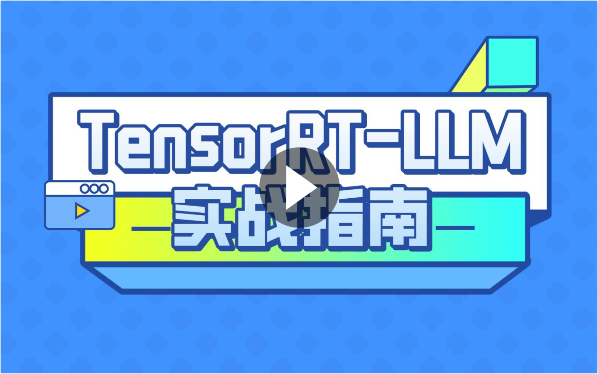

### [README FOR ENGLISH](qwen2/README.md)
# 总述
### 背景介绍
- 介绍本工作是 <a href="https://github.com/NVIDIA/trt-samples-for-hackathon-cn/tree/master/Hackathon2023">NVIDIA TensorRT Hackathon 2023</a> 的参赛题目，本项目使用TRT-LLM完成对Qwen-7B-Chat实现推理加速。相关代码已经放在[release/0.1.0](https://github.com/Tlntin/Qwen-TensorRT-LLM/tree/release/0.1.0)分支，感兴趣的同学可以去该分支学习完整流程。

#### 自2024年4月24日起，[TensorRT-LLM官方仓库](https://github.com/NVIDIA/TensorRT-LLM/)最新main分支已经支持qwen/qwen2，故本仓库不再做重大更新。

### 功能概述

- FP16 / BF16(实验性)
- INT8 Weight-Only & INT8 Smooth Quant & INT4 Weight-Only & INT4-AWQ & INT4-GPTQ
- INT8 KV CACHE
- Tensor Parallel（多卡并行）
- 基于gradio搭建web demo
- 支持triton部署api，结合`inflight_batching`实现最大吞吐/并发。
- 支持fastapi搭建兼容openai请求的api，并且支持function call调用。
- 支持cli命令行对话。
- 支持langchain接入。

### 支持的模型：qwen2（推荐）/qwen（当前仅维护到0.7.0）/qwen-vl（当前仅维护到0.7.0）

- base模型（实验性）：[Qwen1.5-0.5B](https://huggingface.co/Qwen/Qwen1.5-0.5B)、[Qwen1.5-1.8B](https://huggingface.co/Qwen/Qwen1.5-1.8B)、[Qwen1.5-4B](https://huggingface.co/Qwen/Qwen1.5-4B)、[Qwen1.5-7B](https://huggingface.co/Qwen/Qwen1.5-7B)、[Qwen1.5-14B](https://huggingface.co/Qwen/Qwen1.5-14B)、[Qwen1.5-32B](https://huggingface.co/Qwen/Qwen1.5-32B)、[Qwen1.5-72B](https://huggingface.co/Qwen/Qwen1.5-72B)、[QWen-VL](https://huggingface.co/Qwen/Qwen-VL)、[CodeQwen1.5-7B](https://huggingface.co/Qwen/CodeQwen1.5-7B)
- chat模型（推荐）：[Qwen1.5-0.5B-Chat](https://huggingface.co/Qwen/Qwen1.5-0.5B-Chat)、[Qwen1.5-1.8B-Chat](https://huggingface.co/Qwen/Qwen1.5-1.8B-Chat)、[Qwen1.5-4B-Chat](https://huggingface.co/Qwen/Qwen1.5-4B-Chat)、[Qwen1.5-7B-Chat](https://huggingface.co/Qwen/Qwen1.5-7B-Chat)、[Qwen1.5-14B-Chat](https://huggingface.co/Qwen/Qwen1.5-14B-Chat)、[Qwen1.5-32B-Chat](https://huggingface.co/Qwen/Qwen1.5-32B-Chat)、[Qwen1.5-72B-Chat](https://huggingface.co/Qwen/Qwen1.5-72B-Chat)（实验性）、[QWen-VL-Chat](https://huggingface.co/Qwen/Qwen-VL-Chat)、[CodeQwen1.5-7B-Chat](https://huggingface.co/Qwen/CodeQwen1.5-7B-Chat)
- chat-gptq-int4模型：[Qwen1.5-0.5B-Chat-GPTQ-Int4](https://huggingface.co/Qwen/Qwen1.5-0.5B-Chat-GPTQ-Int4)、[Qwen1.5-1.8B-Chat-GPTQ-Int4](https://huggingface.co/Qwen/Qwen1.5-1.8B-Chat-GPTQ-Int4)、[Qwen1.5-4B-Chat-GPTQ-Int4](https://huggingface.co/Qwen/Qwen1.5-4B-Chat-GPTQ-Int4)、[Qwen1.5-7B-Chat-GPTQ-Int4](https://huggingface.co/Qwen/Qwen1.5-7B-Chat-GPTQ-Int4)、[Qwen1.5-14B-Chat-GPTQ-Int4](https://huggingface.co/Qwen/Qwen1.5-14B-Chat-GPTQ-Int4)、[Qwen1.5-32B-Chat-GPTQ-Int4](https://huggingface.co/Qwen/Qwen1.5-32B-Chat-GPTQ-Int4)、[Qwen1.5-72B-Chat-GPTQ-Int4](https://huggingface.co/Qwen/Qwen1.5-72B-Chat-GPTQ-Int4)（实验性）、[Qwen-VL-Chat-Int4](https://huggingface.co/Qwen/Qwen-VL-Chat-Int4)

### 相关教程：
- 本项目配套B站教程：

  <a href="https://www.bilibili.com/video/BV12M411D7uS/"></a>

- 本项目配套博客适配概述：[如何在 NVIDIA TensorRT-LLM 中支持 Qwen 模型](https://developer.nvidia.com/zh-cn/blog/qwen-model-support-nvidia-tensorrt-llm)

- [TensorRT-LLM的模型量化：实现与性能科普视频](https://www.bilibili.com/video/BV1Pw411h7nM/?spm=a2c22.12281976.0.0.6ee62084utHBCm)


### 软硬件要求

- Linux最佳，已安装docker，并且安装了nvidia-docker（[安装指南](https://docs.nvidia.com/datacenter/cloud-native/container-toolkit/latest/install-guide.html)），Windows理论也可以，但是还未测试，感兴趣可以自己研究一下。
- Windows参考这个教程：[链接](https://zhuanlan.zhihu.com/p/676095460)
- 有英伟达显卡（30系，40系，V100/A100等），以及一定的显存、内存、磁盘。结合[Qwen官方推理要求](https://github.com/QwenLM/Qwen/blob/main/README_CN.md#%E6%8E%A8%E7%90%86%E6%80%A7%E8%83%BD)，预估出下面的要求，详见表格（仅编译期最大要求），仅供参考：

<table>
    <tr>
        <td>Model Size</td>
        <td>Quantization</td>
        <td>GPU Memory Usage (GB)</td>
        <td>CPU Memory Usage (GB)</td>
        <td>Disk Usage (GB)</td>
    </tr>
    <!-- 1.8b -->
    <tr>
        <td rowspan="7">1.8B</td>
        <td>fp16</td>
        <td>5</td>
        <td>15</td>
        <td>11</td>
    </tr>
    <tr>
        <td>int8 smooth quant</td>
        <td>5</td>
        <td>15</td>
        <td>22</td>
    </tr>
    <tr>
        <td>int8 weight only</td>
        <td>4</td>
        <td>12</td>
        <td>9</td>
    </tr>
    <tr>
        <td>int4 weight only</td>
        <td>4</td>
        <td>10</td>
        <td>7</td>
    </tr>
    <tr>
        <td>int4 gptq (raw)</td>
        <td>4</td>
        <td>10</td>
        <td>6</td>
    </tr>
    <tr>
        <td>int4 gptq (manual)</td>
        <td>5</td>
        <td>13</td>
        <td>14</td>
    </tr>
    <tr>
        <td>int4 awq</td>
        <td>5</td>
        <td>13</td>
        <td>18</td>
    </tr>
    <!-- 7b -->
    <tr>
        <td rowspan="7">7B</td>
        <td>fp16</td>
        <td>21</td>
        <td>59</td>
        <td>42</td>
    </tr>
    <tr>
        <td>int8 smooth quant</td>
        <td>21</td>
        <td>59</td>
        <td>84</td>
    </tr>
    <tr>
        <td>int8 weight only</td>
        <td>14</td>
        <td>39</td>
        <td>28</td>
    </tr>
    <tr>
        <td>int4 weight only</td>
        <td>10</td>
        <td>29</td>
        <td>21</td>
    </tr>
    <tr>
        <td>int4 gptq (raw)</td>
        <td>10</td>
        <td>29</td>
        <td>16</td>
    </tr>
    <tr>
        <td>int4 gptq (manual)</td>
        <td>21</td>
        <td>51</td>
        <td>42</td>
    </tr>
    <tr>
        <td>int4 awq</td>
        <td>21</td>
        <td>51</td>
        <td>56</td>
    </tr>
    <!-- 14b -->
    <tr>
        <td rowspan="7">14B</td>
        <td>fp16</td>
        <td>38</td>
        <td>106</td>
        <td>75</td>
    </tr>
    <tr>
        <td>int8 smooth quant</td>
        <td>38</td>
        <td>106</td>
        <td>150</td>
    </tr>
    <tr>
        <td>int8 weight only</td>
        <td>24</td>
        <td>66</td>
        <td>47</td>
    </tr>
    <tr>
        <td>int4 weight only</td>
        <td>16</td>
        <td>46</td>
        <td>33</td>
    </tr>
    <tr>
        <td>int4 gptq (raw)</td>
        <td>16</td>
        <td>46</td>
        <td>26</td>
    </tr>
    <tr>
        <td>int4 gptq (manual)</td>
        <td>38</td>
        <td>90</td>
        <td>66</td>
    </tr>
    <tr>
        <td>int4 awq</td>
        <td>38</td>
        <td>90</td>
        <td>94</td>
    </tr>
    <!-- 72b -->
    <tr>
        <td rowspan="7">72B</td>
        <td>fp16</td>
        <td>181</td>
        <td>506</td>
        <td>362</td>
    </tr>
    <tr>
        <td>int8 smooth quant</td>
        <td>181</td>
        <td>506</td>
        <td>724</td>
    </tr>
    <tr>
        <td>int8 weight only</td>
        <td>102</td>
        <td>284</td>
        <td>203</td>
    </tr>
    <tr>
        <td>int4 weight only</td>
        <td>61</td>
        <td>171</td>
        <td>122</td>
    </tr>
    <tr>
        <td>int4 gptq (raw)</td>
        <td>61</td>
        <td>171</td>
        <td>98</td>
    </tr>
    <tr>
        <td>int4 gptq (manual)</td>
        <td>181</td>
        <td>434</td>
        <td>244</td>
    </tr>
    <tr>
        <td>int4 awq</td>
        <td>181</td>
        <td>434</td>
        <td>406</td>
    </tr>
</table>


# 快速入门

### 准备工作
1. 下载镜像。
    - 官方triton镜像24.02，对应TensorRT-LLM版本为0.8.0，不含TensorRT-LLM开发包。
      ```bash
      docker pull nvcr.io/nvidia/tritonserver:24.02-trtllm-python-py3
      ```
    
    - **对于Windows用户想体验tritonserver部署的，或者无GPU的用户，可以使用AutoDL镜像，含tritonserver，版本为24.02（对应tensorrt_llm 0.8.0)，[链接](https://www.codewithgpu.com/i/triton-inference-server/tensorrtllm_backend/tensorrtllm_backend)，注：该链接包含完整编译教程。**
      
    
2. 拉取本项目代码

    ```bash
    git clone https://github.com/Tlntin/Qwen-TensorRT-LLM.git
    cd Qwen-TensorRT-LLM
    ```

3. 进入项目目录，然后创建并启动容器，同时将本地`examples`代码路径映射到`/app/tensorrt_llm/examples`路径，然后打开8000和7860端口的映射，方便调试api和web界面。

    ```bash
    docker run --gpus all \
      --name trt_llm \
      -d \
      --ipc=host \
      --ulimit memlock=-1 \
      --restart=always \
      --ulimit stack=67108864 \
      -p 8000:8000 \
      -p 7860:7860 \
      -v ${PWD}/examples:/app/tensorrt_llm/examples \
      nvcr.io/nvidia/tritonserver:24.02-trtllm-python-py3 sleep 8640000
    ```

4. 进入docker容器里面的qwen2路径，
    - 使用pip直接安装官方编译好的tensorrt_llm，需要先安装numpy1.x,不兼容numpy2.x。
      ```bash
      pip install "numpy<2"
      pip install tensorrt_llm==0.8.0 --extra-index-url https://pypi.nvidia.com --extra-index-url https://download.pytorch.org/whl/cu121
      ```
    - 安装提供的Python依赖
      ```bash
      cd /app/tensorrt_llm/examples/qwen2/
      pip install -r requirements.txt
      ```
    
    - 升级transformers版本，qwen2最低需要4.37以上版本，如果有警告依赖不匹配可以忽略。
      ```bash
      pip install "transformers>=4.37"
      ```

5. 从HuggingFace下载模型（暂时不支持其他平台），例如`QWen1.5-7B-Chat`模型，然后将文件夹重命名为`qwen1.5_7b_chat`，最后放到`examples/qwen2/`路径下即可。

6. 修改编译参数（可选）

    - 默认编译参数，包括batch_size, max_input_len, max_new_tokens, seq_length都存放在`default_config.py`中
    - 默认模型路径，包括`hf_model_dir`（模型路径）和`tokenizer_dir`（分词器路径）以及`int4_gptq_model_dir`（手动gptq量化输出路径），可以改成你自定义的路径。
    - 对于24G显存用户，直接编译即可，默认是fp16数据类型，max_batch_size=2
    - 对于低显存用户，可以降低max_batch_size=1，或者继续降低max_input_len, max_new_tokens

### 运行指南（fp16模型）
1. 编译。

    - 编译fp16（注：`--remove_input_padding`和`--enable_context_fmha`为可选参数，可以一定程度上节省显存）。

      ```bash
      python3 build.py --remove_input_padding --enable_context_fmha
      ```
    
    - 编译 int8 (weight only)。

      ```bash
      python3 build.py --use_weight_only --weight_only_precision=int8
      ```
    
    - 编译int4 (weight only)
      ```bash
      python3 build.py --use_weight_only --weight_only_precision=int4
      ```
    
    - 对于如果单卡装不下，又不想用int4/int8量化，可以选择尝试tp = 2，即启用两张GPU进行编译 （注：tp功能目前只支持从Huggingface格式构建engine）
      ```bash
      python3 build.py --world_size 2 --tp_size 2
      ```
    
2. 运行。编译完后，再试跑一下，输出`Output: "您好，我是来自达摩院的大规模语言模型，我叫通义千问。"`这说明成功。

    - tp = 1（默认单GPU）时使用python直接运行run.py
      ```bash
      python3 run.py
      ```

    - tp = 2（2卡用户，或者更多GPU卡）时，使用`mpirun`命令来运行run.py
      ```bash
      mpirun -n 2 --allow-run-as-root python run.py
      ```
    - **使用官方24.02容器多卡可能会报错，提示：`Failed, NCCL error /home/jenkins/agent/workspace/LLM/release-0.8/L0_PostMerge/tensorrt_llm/cpp/tensorrt_llm/plugins/ncclPlugin/allreducePlugin.cpp:183 'unknown result code'`,需要安装nccl2.20.3-1（使用压缩包，解压后导入系统环境变量或者使用apt命名安装均可），安装后即可正常运行。**
      
       ```bash
       export LD_LIBRARY_PATH=nccl_2.20.3-1+cuda12.3_x86_64/lib/:$LD_LIBRARY_PATH
       # 或者，推荐下面这种
       apt update && apt-get install -y --no-install-recommends libnccl2=2.20.3-1+cuda12.3 libnccl-dev=2.20.3-1+cuda12.3 -y
       ```

3. 验证模型精度。可以试试跑一下`summarize.py`，对比一下huggingface和trt-llm的rouge得分。这一步需要在线下载数据集，对于网络不好的用户，可以参考该方法：[datasets离线加载huggingface数据集方法](./docs/load_hf_dataset.md)

     - 跑hugggingface版
     
       ```bash
       python3 summarize.py --test_hf
       ```
     
     - 跑trt-llm版

       ```bash
       python3 summarize.py --test_trt_llm
       ```
     
     - 一般来说，如果trt-llm的rouge分数和huggingface差不多，略低一些（1以内）或者略高一些（2以内），则说明精度基本对齐。

4. 测量模型吞吐速度和生成速度。需要下载`ShareGPT_V3_unfiltered_cleaned_split.json`这个文件。

     - 可以通过wget/浏览器直接下载，[下载链接](https://huggingface.co/datasets/anon8231489123/ShareGPT_Vicuna_unfiltered/resolve/main/ShareGPT_V3_unfiltered_cleaned_split.json)
     - 也可通过百度网盘下载，链接: https://pan.baidu.com/s/12rot0Lc0hc9oCb7GxBS6Ng?pwd=jps5 提取码: jps5
     - 下载后同样放到`examples/qwen2/`路径下即可
     - 测量前，如果需要改max_input_length/max_new_tokens，可以直接改`default_config.py`即可。一般不推荐修改，如果修改了这个，则需要重新编译一次trt-llm，保证两者输入数据集长度统一。
     - 测量huggingface模型

       ```bash
       python3 benchmark.py --backend=hf --dataset=ShareGPT_V3_unfiltered_cleaned_split.json --hf_max_batch_size=1
       ```

     - 测量trt-llm模型 (注意：`--trt_max_batch_size`不应该超过build时候定义的最大batch_size，否则会出现内存错误。)

       ```bash
       python3 benchmark.py --backend=trt_llm --dataset=ShareGPT_V3_unfiltered_cleaned_split.json --trt_max_batch_size=1
       ```

### 运行指南（Smooth Quant）(强烈推荐)
1. 注意：运行Smooth Quant需要将huggingface模型完全加载到GPU里面，用于构建int8标定数据集，所以需要提前确保你的显存够大，能够完全加载整个模型。

2. 将Huggingface格式的数据转成FT(FastTransformer)需要的数据格式，这一步需要在线下载数据集，对于网络不好的用户，可以参考该方法：[datasets离线加载huggingface数据集方法](./docs/load_hf_dataset.md)

    - 单卡

      ```bash
      python3 hf_qwen_convert.py --smoothquant=0.5
      ```
    - 多卡（以2卡为例）
      ```bash
      python3 hf_qwen_convert.py --smoothquant=0.5 --tensor-parallelism=2
      ```

3. 开始编译trt_engine

    - 单卡
      ```bash
      python3 build.py --use_smooth_quant --per_token --per_channel
      ```
    - 多卡（以2卡为例）
      ```bash
      python3 build.py --use_smooth_quant --per_token --per_channel --world_size 2 --tp_size 2
      ```

4. 编译完成，run/summarize/benchmark等等都和上面的是一样的了。

### 运行指南（int8-kv-cache篇）
1. 注意：运行int8-kv-cache需要将huggingface模型完全加载到GPU里面，用于构建int8标定数据集，所以需要提前确保你的显存够大，能够完全加载整个模型。

2. 将Huggingface格式的数据转成FT(FastTransformer)需要的数据格式。
    - 单卡
      ```bash
      python3 hf_qwen_convert.py --calibrate-kv-cache
      ```
    - 多卡（以2卡为例）
      ```bash
      python3 hf_qwen_convert.py --calibrate-kv-cache --tensor-parallelism=2
      ```

3. 编译int8 weight only + int8-kv-cache
    - 单卡
      ```bash
      python3 build.py --use_weight_only --weight_only_precision=int8 --int8_kv_cache
      ```
    - 多卡（以2卡为例）
      ```bash
      python3 build.py --use_weight_only --weight_only_precision=int8 --int8_kv_cache --world_size 2 --tp_size 2
      ```

### 运行指南（int4-gptq篇）
1. 需要安装[auto-gptq](https://github.com/PanQiWei/AutoGPTQ)模块，并且升级transformers模块版本到最新版（建议optimum和transformers都用最新版，否则可能有乱码问题），参考[issue/68](https://github.com/Tlntin/Qwen-TensorRT-LLM/issues/68)。（注：安装完模块后可能会提示tensorrt_llm与其他模块版本不兼容，可以忽略该警告）
    ```bash
    pip install auto-gptq optimum
    pip install transformers -U
    ```

2. 手动获取标定权重（可选）
    - 转权重获取scale相关信息，默认使用GPU进行校准，需要能够完整加载模型。（注：对于Qwen-7B-Chat V1.0，可以加上`--device=cpu`来尝试用cpu标定，但是时间会很长）
      ```bash
      python3 gptq_convert.py
      ```
    - 编译TensorRT-LLM Engine
      ```bash
      python build.py --use_weight_only \
                --weight_only_precision int4_gptq \
                --per_group
      ```
    - 如果想要节省显存（注：只能用于单batch），可以试试加上这俩参数来编译Engine
      ```bash
      python build.py --use_weight_only \
                --weight_only_precision int4_gptq \
                --per_group \
                --remove_input_padding \
                --enable_context_fmha
      ```

3. 使用官方int4权重，例如Qwen-xx-Chat-Int4模型（推荐）
    - 编译模型，注意设置hf模型路径和`--quant_ckpt_path`量化后权重路径均设置为同一个路径，下面是32b-gptq-int4模型的示例（其他gptq-int4模型也是一样操作）
      ```bash
      python build.py --use_weight_only \
                --weight_only_precision int4_gptq \
                --per_group \
                --hf_model_dir Qwen1.5-32B-Chat-GPTQ-Int4 \
                --quant_ckpt_path Qwen1.5-32B-Chat-GPTQ-Int4
      ```
    - 运行模型，这里需要指定一下tokenizer路径
      ```bash
      python3 run.py --tokenizer_dir=Qwen1.5-32B-Chat-GPTQ-Int4
      ```

### 运行指南（int4-awq篇）
1. 需要下载并安装nvidia-ammo模块（仅支持Linux，不支持Windows）
    ```bash
    pip install --no-cache-dir --extra-index-url https://pypi.nvidia.com nvidia-ammo~=0.7.0
    ```
2. 运行int4-awq量化代码，导出校准权重。
    ```bash
    python3 quantize.py --export_path ./qwen2_7b_4bit_gs128_awq.pt
    ```
3. 运行build.py，用于构建TensorRT-LLM Engine。
    ```bash
    python build.py --use_weight_only \
                    --weight_only_precision int4_awq \
                    --per_group \
                    --quant_ckpt_path ./qwen2_7b_4bit_gs128_awq.pt
    ```
4. 如果想要节省显存（注：只能用于单batch），可以试试加上这俩参数来编译Engine
    ```bash
    python build.py --use_weight_only \
                    --weight_only_precision int4_awq \
                    --per_group \
                    --remove_input_padding \
                    --enable_context_fmha \
                    --quant_ckpt_path ./qwen2_7b_4bit_gs128_awq.pt
    ```

<details>
<summary><h1>其他应用</h1></summary>
<ol>
<li><p>尝试终端对话。运行下面的命令，然后输入你的问题，直接回车即可。</p>
<pre><code class="language-bash">python3 cli_chat.py
</code></pre>
</li>
<li><p>部署api，并调用api进行对话。</p>
<ul>
<li>部署api</li>
</ul>
<pre><code class="language-bash">python3 api.py
</code></pre>
<ul>
<li>另开一个终端，进入<code>qwen2/client</code>目录，里面有4个文件，分别代表不同的调用方式。</li>
<li><code>async_client.py</code>，通过异步的方式调用api，通过SSE协议来支持流式输出。</li>
<li><code>normal_client.py</code>，通过同步的方式调用api，为常规的HTTP协议，Post请求，不支持流式输出，请求一次需要等模型生成完所有文字后，才能返回。</li>
<li><code>openai_normal_client.py</code>，通过<code>openai</code>模块直接调用自己部署的api，该示例为非流式调用，请求一次需要等模型生成完所有文字后，才能返回。。</li>
<li><code>openai_stream_client.py</code>，通过<code>openai</code>模块直接调用自己部署的api，该示例为流式调用。</li>
<li>注意：需要<code>pydantic</code>模块版本&gt;=2.3.2，否则将会出现<code>ChatCompletionResponse&#39; object has no attribute &#39;model_dump_json&#39;</code>报错，参考<a href="https://github.com/Tlntin/Qwen-7B-Chat-TensorRT-LLM/issues/27">issue</a></li>
</ul>
</li>
<li><p>尝试网页对话（可选，需要先部署api）。运行下面的命令，然后打开本地浏览器，访问：<a href="http://127.0.0.1:7860">http://127.0.0.1:7860</a> 即可</p>
<pre><code class="language-bash">python3 web_demo.py
</code></pre>
<ul>
<li>默认配置的web_demo.py如下：</li>
</ul>
<pre><code class="language-python">demo.queue().launch(share=False, inbrowser=True)
</code></pre>
<ul>
<li>如果是服务器运行，建议改成这样</li>
</ul>
<pre><code class="language-python">demo.queue().launch(server_name=&quot;0.0.0.0&quot;, share=False, inbrowser=False) 
</code></pre>
<ul>
<li>web_demo参数说明<ul>
<li><code>share=True</code>: 代表将网站穿透到公网，会自动用一个随机的临时公网域名，有效期3天，不过这个选项可能不太安全，有可能造成服务器被攻击，不建议打开。</li>
<li><code>inbrowser=True</code>: 部署服务后，自动打开浏览器，如果是本机，可以打开。如果是服务器，不建议打开，因为服务器也没有谷歌浏览器给你打开。</li>
<li><code>server_name=&quot;0.0.0.0&quot;</code>: 允许任意ip访问，适合服务器，然后你只需要输入<code>http://[你的ip]: 7860</code>就能看到网页了，如果不开这个选择，默认只能部署的那台机器才能访问。</li>
<li><code>share=False</code>：仅局域网/或者公网ip访问，不会生成公网域名。</li>
<li><code>inbrowser=False</code>： 部署后不打开浏览器，适合服务器。</li>
</ul>
</li>
</ul>
</li>
<li><p>web_demo运行效果（测试平台：RTX 4080, qwen2-7b-chat, int4 weight only)</p>
</li>
</ol>
<p><a href="https://github.com/Tlntin/Qwen-7B-Chat-TensorRT-LLM/assets/28218658/940c1ed1-14f7-45f6-bf13-67c8f289c956">https://github.com/Tlntin/Qwen-7B-Chat-TensorRT-LLM/assets/28218658/940c1ed1-14f7-45f6-bf13-67c8f289c956</a></p>
</details>

# 进阶工作

1. 参考该教程部署tritonserver：[Triton24.02部署TensorRT-LLM,实现http查询](./docs/triton_deploy_trt-llm.md)
2. 使用该项目封装tritonserver以支持openai API格式，项目链接：https://github.com/zhaohb/fastapi_tritonserver

## Stargazers over time

 [](https://starchart.cc/Tlntin/Qwen-TensorRT-LLM)
