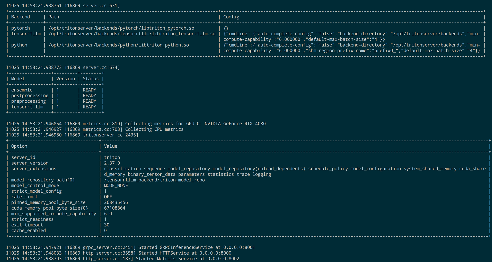

# Triton部署TensorRT-LLM

## 编译triton/tensorrtllm_backend Docker镜像
### 背景：
- 在Triton 23.10发布后，才会内置TensorRT-LLM支持
- 目前Triton最新版是23.09,暂时不支持，所以需要手动编译Docker镜像
- 可以用下面的命令手动编译Docker镜像（推荐），也可以用我编译好的镜像（仅在RTX 3090上面测试，不保证其他显卡可用，不过理论上30系/40系应该都可以）
```bash
docker pull registry.cn-guangzhou.aliyuncs.com/tlntin/triton_trt_llm:v0.5.0
docker tag registry.cn-guangzhou.aliyuncs.com/tlntin/triton_trt_llm:v0.5.0 triton_trt_llm
```

1. 拉取本项目代码
```bash
git clone https://github.com/triton-inference-server/tensorrtllm_backend.git -b release/0.5.0

cd tensorrtllm_backend
```

2. 拉取子模块（目前只依赖TensorRT-LLM) 代码
```bash
git submodule update --init --recursive
git lfs install
git lfs pull
```

3. 编译dokcer镜像
- For x86_64
```bash
DOCKER_BUILDKIT=1 docker build -t triton_trt_llm -f dockerfile/Dockerfile.trt_llm_backend .
```

- For aarch64
```bash
DOCKER_BUILDKIT=1 docker build -t triton_trt_llm --build-arg TORCH_INSTALL_TYPE="src_non_cxx11_abi" -f dockerfile/Dockerfile.trt_llm_backend .
```
4. 编译完成后，你将看到有一个名为`triton_trt_llm`的镜像。

### 编译TensorRT Engine
- 下面直接用这个仓库来编译：https://github.com/Tlntin/Qwen-7B-Chat-TensorRT-LLM
- 其实Triton里面已经内置了TensorRT-LLM，所以建议在Triton容器里面进行编译，防止环境不一致问题。

### 开启inflight_batching（可选）
- 如果需要支持`inflight_batching`功能，则需要在build阶段加上下面三个参数：
```bash
--use_inflight_batching
--paged_kv_cache
--remove_input_padding
```
- 为啥要开这三个参数？从下面`qwen/build.py`中的这段代码可以看出来，第一个参数依赖后面两个参数，而`use_gpt_attention_plugin`在本仓库是默认开启的，所以可以忽略。
```bash
if args.use_inflight_batching:
	if not args.use_gpt_attention_plugin:
		args.use_gpt_attention_plugin = 'float16'
		logger.info(
			f"Using GPT attention plugin for inflight batching mode. Setting to default '{args.use_gpt_attention_plugin}'"
		)
	if not args.remove_input_padding:
		args.remove_input_padding = True
		logger.info(
			"Using remove input padding for inflight batching mode.")
	if not args.paged_kv_cache:
		args.paged_kv_cache = True
		logger.info("Using paged KV cache for inflight batching mode.")
```
- 下面是一个简单示例（以smooth quant int8量化为例）：
```bash
python3 hf_qwen_convert.py --smoothquant=0.5
python3 build.py \
	--use_smooth_quant \
	--per_token \
	--per_channel \
	--use_inflight_batching \
	--paged_kv_cache \
	--remove_input_padding
```


### 部署Triton 服务
1. 进入`tensorrtllm_backend`的上一层目录，运行最开始编译好的容器，然后将`tensorrtllm_backend`映射到容器里面去
```bash
docker run \
	-d \
	--name triton \
	--net host \
	--shm-size=2g \
	--ulimit memlock=-1 \
	--ulimit stack=67108864 \
	--gpus all \
	-v ${PWD}/tensorrtllm_backend:/tensorrtllm_backend \
	triton_trt_llm sleep 8640000
```

2. 进入容器
```bash
docker exec -it triton /bin/bash
```

3. 观察映射是否ok，有输出文件，就是ok的
```bash
ls /tensorrtllm_backend
```

4. 进入该目录，然后创建一个`triton_model_repo`目录，用于存放待推理的模型
```bash
cd /tensorrtllm_backend
mkdir triton_model_repo
```

5. 拷贝一些默认的样例配置到刚刚创建的目录。
```bash
cp -r all_models/inflight_batcher_llm/* triton_model_repo/
```

6. 将前面编译的TensorRT-LLM的Engine文件拷贝到Triton里面，可以参考下面的做法
- 进入Qwen里面的Engine路径
```bash
cd /app/tensorrt_llm/examples/qwen/trt_engines/fp16/1-gpu/
```
- 再将Qwen Engine拷贝给Triton
```bash
cp -r ./* /tensorrtllm_backend/triton_model_repo/tensorrt_llm/1/
```

- 再把Qwen的tokenizer的文件拷贝给Triton，省事起见，可以将整个`qwen_7b_chat`都拷贝过去
```bash
cd /app/tensorrt_llm/examples/qwen/
cp -r qwen_7b_chat /tensorrtllm_backend/triton_model_repo/tensorrt_llm/
```
- 然后重新进入Triton的容器

7. 编写Triton中的预处理配置， 修改`triton_model_repo/preprocessing/config.pbtxt`文件
- 修改前
```pbtxt
parameters {
  key: "tokenizer_dir"
  value: {
	string_value: "${tokenizer_dir}"
  }
}

parameters {
  key: "tokenizer_type"
  value: {
	string_value: "${tokenizer_type}"
  }
}
```
- 修改后
```pbtxt
parameters {
  key: "tokenizer_dir"
  value: {
	string_value: "/tensorrtllm_backend/triton_model_repo/tensorrt_llm/qwen_7b_chat"
  }
}

parameters {
  key: "tokenizer_type"
  value: {
	string_value: "auto"
  }
}
```

8. 编写Triton中的预处理配置， 修改`triton_model_repo/preprocessing/1/model.py`文件，加一个`trust_remote_code=True`，否则会不兼容本地的tokenizer
- 修改前
```python
elif tokenizer_type == 'auto':
		self.tokenizer = AutoTokenizer.from_pretrained(tokenizer_dir, padding_side='left')
```
- 修改后
```python
elif tokenizer_type == 'auto':
		self.tokenizer = AutoTokenizer.from_pretrained(
			tokenizer_dir,
			padding_side='left',
			trust_remote_code=True
		)
```
    - 改一下max-batch-size，默认是`max_batch_size: 128`改成你之前编译设置的max_batch_size即可，编译的设置max_batch_size=4，所以我这里也设置为4（测试发现最低需要设置为4，后面会讲到）。

9.  编写Triton中的trt_llm配置， 修改`triton_model_repo/tensorrt_llm/config.pbtxt`文件
- 修改前（用于开启流）
```pbtxt
model_transaction_policy {
  decoupled: ${decoupled_mode}
}
```
- 修改后
```pbtxt
model_transaction_policy {
  decoupled: true
}
```

- 修改前（模型路径）
```pbtxt
parameters: {
  key: "gpt_model_path"
  value: {
	string_value: "${engine_dir}"
  }
}
```
- 修改后
```pbtxt
parameters: {
  key: "gpt_model_path"
  value: {
	string_value: "/tensorrtllm_backend/triton_model_repo/tensorrt_llm/1"
  }
}
```
- 默认配置是开启了inflight-batching的，如果要关闭，需要做下面的修改
- 修改前：
```pbtxt
parameters: {
  key: "gpt_model_type"
  value: {
	string_value: "inflight_fused_batching"
  }
}
```
- 修改后
```pbtxt
parameters: {
  key: "gpt_model_type"
  value: {
	string_value: "V1"
  }
}
```
- 改一下max-batch-size，默认是`max_batch_size: 128`改成你之前编译设置的max_batch_size即可，编译的设置max_batch_size=4，所以我这里也设置为4（测试发现最低需要设置为4，后面会讲到）。

10. 编写Triton中的trt_llm配置， 修改`triton_model_repo/postprocessing/config.pbtxt`，基本和修改`triton_model_repo/preprocessing/`部分一样，不再重复阐述。

11. 安装qwen需要的几个必选依赖
```bash
pip install sentencepiece~=0.1.99 tiktoken
```

12. 启动Triton服务
```bash
cd /tensorrtllm_backend
python3 scripts/launch_triton_server.py --world_size=1 --model_repo=/tensorrtllm_backend/triton_model_repo
```

13. 启动后发现报错，是tokenizer找不到eos_token，这个之前适配qwen到trt-llm时也遇到过，只需要简单修改一下preprocess/postprocess的model.py即可即可。
- 修改前：
```python
self.tokenizer.pad_token = self.tokenizer.eos_token

self.pad_id = self.tokenizer.encode(self.tokenizer.pad_token,
								   add_special_tokens=False)[0]
```
- 修改后
```bash
gen_config_path = os.path.join(tokenizer_dir, 'generation_config.json')
with open(gen_config_path, 'r') as f:
	gen_config = json.load(f)
chat_format = gen_config['chat_format']
if chat_format == "raw":
	self.eos_id = gen_config['eos_token_id']
	self.pad_id = gen_config['pad_token_id']
elif chat_format == "chatml":
	self.pad_id = self.eos_id = self.tokenizer.im_end_id
else:
	raise Exception("unkown chat format ", chat_format)
eos_token = self.tokenizer.decode(self.eos_id)
self.tokenizer.eos_token = eos_token
self.tokenizer.pad_token = eos_token
```

14. 再次启动发现还是报错，这次是显存不够。之前明明是可以的，为啥现在不够了呢？经排查发现，默认是max_batch_size>=4，设置成低于4的max_batch_size则不起作用。所以我再重新编译了一下int4 weight only的Engine，并且测试了benchmark下，batch_size=4时，确实会溢出。

15. 我将default_config.py里面的`trt_max_batch_size`设置为4，`max_input_len`和`max_new_tokens`设置为1024，然后用int4/int8再次编译，然后测试max_batch_size=4下的benchmark，显存正常。
16. 再次启动服务，提示8000端口被占用（被之前的qwen容器的api占用了），关闭对应的服务，或者删除对应的容器即可。


### 总结
- 上述文件已经上传到仓库https://github.com/Tlntin/Qwen-7B-Chat-TensorRT-LLM 的`triton_model_repo`目录
- 只需要启动将本仓库的`triton_model_repo`目录复制到`tensorrtllm_backend`目录中即可
```bash
# ....省略拉取两个仓库的过程.....
# 拷贝tensorrtllm_backend到tensorrtllm_backend目录中
cp -rf Qwen-7B-Chat-TensorRT-LLM/triton_model_repo tensorrtllm_backend
```
- 参考docker启动命令
```bash
docker run \
	-d \
	--name triton \
	--net host \
	--shm-size=2g \
	--ulimit memlock=-1 \
	--ulimit stack=67108864 \
	--gpus all \
	-v ${PWD}/tensorrtllm_backend:/tensorrtllm_backend \
	-v ${PWD}/Qwen-7B-Chat-TensorRT-LLM/qwen:/app/tensorrt_llm/examples/qwen \
	triton_trt_llm sleep 8640000
```
- **重复一次之前项目的工作，安装python依赖并编译pytorch模型为TensorRT Engine**
- 复制Engine文件
```bash
cd /app/tensorrt_llm/examples/qwen/trt_engines/fp16/1-gpu/
mkdir /tensorrtllm_backend/triton_model_repo/tensorrt_llm/1/
cp -r ./* /tensorrtllm_backend/triton_model_repo/tensorrt_llm/1/
```
- 复制tokenzer文件
```bash
cd /app/tensorrt_llm/examples/qwen
cp -r qwen_7b_chat /tensorrtllm_backend/triton_model_repo/tensorrt_llm/
```
- 启动服务
```bash
cd /tensorrtllm_backend
python3 scripts/launch_triton_server.py --world_size=1 --model_repo=/tensorrtllm_backend/triton_model_repo
```

- 附成功截图



- 关闭服务
```bash
pgrep tritonserver | xargs kill -9
```


### python客户端请求

1. 安装python依赖
```bash
pip install tritonclient transformers gevent geventhttpclient tiktoken
```
2. 运行`qwen/triton_client/inflight_batcher_llm_client.py`文件即可开启stream+inflight_batching请求，注意，该请求需要triton服务端开启stream+inflight_batching功能，否则请求异常，目前仓库里面的最新配置已经默认开启。
```pbtxt
model_transaction_policy {
  decoupled: True
}

parameters: {
  key: "gpt_model_type"
  value: {
    string_value: "inflight_batching"
  }
}
```
