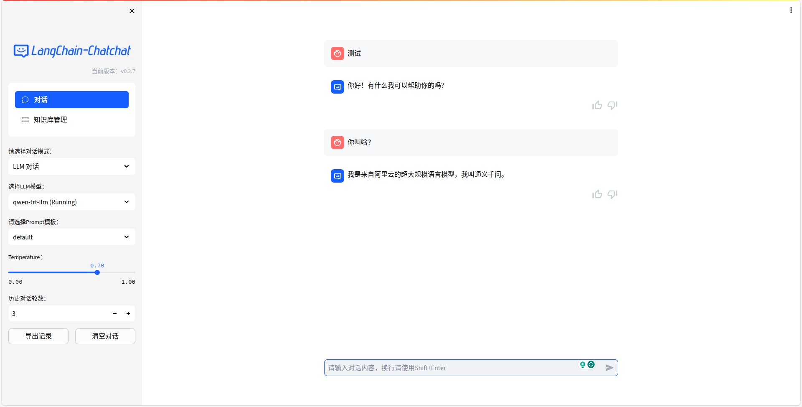

### TensorRT-LLM + Langchain部署

1. 部署Qwen-7B-Chat-TensorRT-LLM , 参考该项目：https://github.com/Tlntin/Qwen-7B-Chat-TensorRT-LLM ，需要部署api。


2. 下载Langchain-Chatchat，当前最新版0.2.7，建议直接用下面的这个魔改后的，用起来比较方便
```bash
git clone https://github.com/Tlntin/Langchain-Chatchat
```
- 环境配置安装readme操作即可。
- 模型下载可以忽略，如果网络好的话，可以在线下载。
- 初始化配置，参考readme操作即可。
```bash
python copy_config_example.py
```

3. 修改模型配置文件`configs/model_config.py`，修改`LLM_MODEL`为`[qwen-trt-llm]`，如果你想添加更多api,可以直接在列表里面加就行。
```bash
# LLM 名称
LLM_MODELS = ["qwen-trt-llm"]
```

4. 修改模型配置文件`configs/model_config.py`，修改url地址为你部署TensorRT-LLM api的地址，默认应该是127.0.0.1:8000,我的8000被占用了，所以换成了5540,你可以改成你的ip和端口。
```bash
"qwen-trt-llm": {
        "api_base_url": "http://127.0.0.1:5540/v1",
        "api_key": "no key",
        "version": "qwen-trt-llm",
        "provider": "QwenTRTLLMWorker",
    },
```

5. 初始化启动数据
```bash
python init_database.py --recreate-vs
```

6. 启动Langchain-Chatchat，会自动打开浏览器
```bash
python startup.py -a
```

7. 再选择LLM模型部分，选择`OpenAI (Running)`即可，然后就可以愉快的聊天了。

8. 如果要知识库问答。
- 先选择`知识库管理`，新建知识库，然后上传任意一个文档上去，推荐点击一下`根据源文件重建向量库`。
- 回到对话，对话模式选择`知识库问答`，最下面的知识库，选择你刚刚新建的那个，然后即可在右边愉快的问答了。

9. 最终效果图
